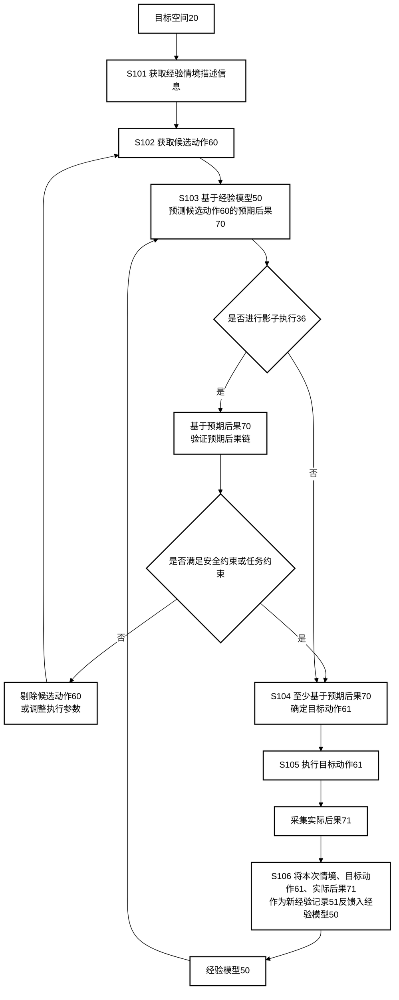
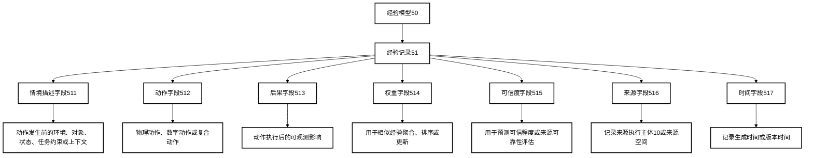
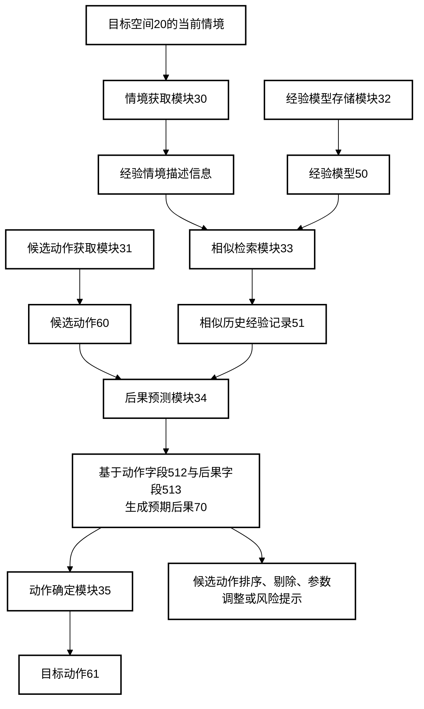
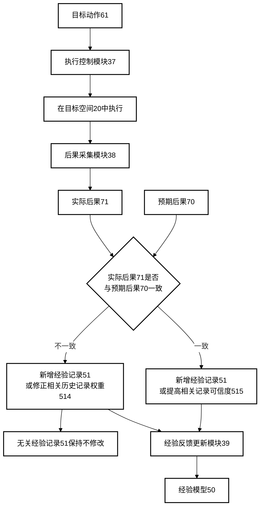
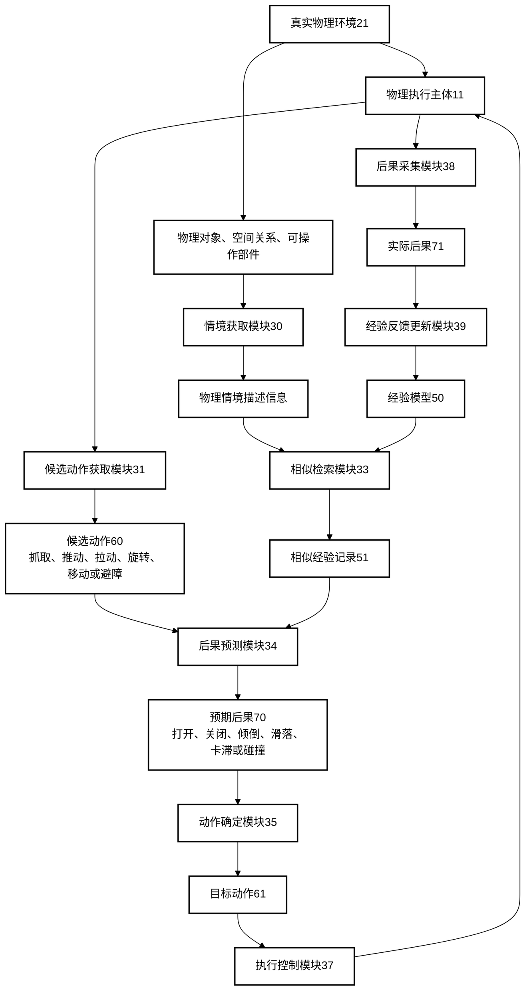
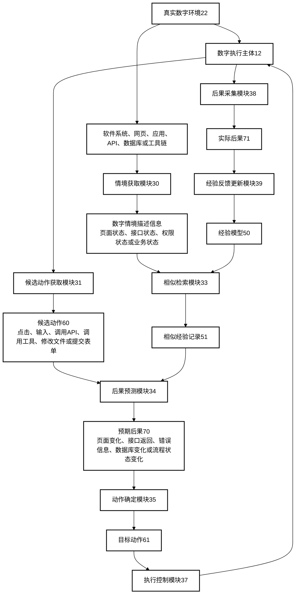
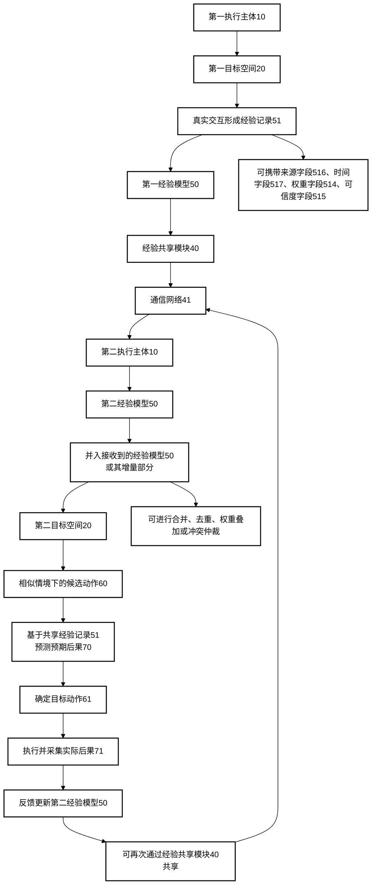

# P011 附图

---

## 图1 基于交互经验类比检索的后果预测与经验自进化方法流程图

---

## 图2 经验记录数据结构示意图

---

## 图3 相似经验检索与候选动作后果预测示意图

---

## 图4 经验模型反馈更新示意图

---

## 图5 物理执行主体操作物理对象的示意图

---

## 图6 数字执行主体操作真实数字环境的示意图

---

## 图7 多执行主体经验共享示意图

