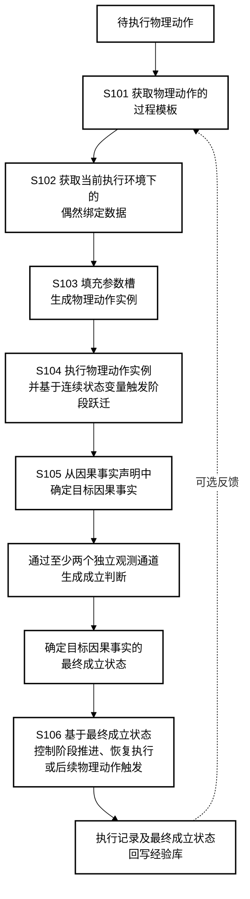
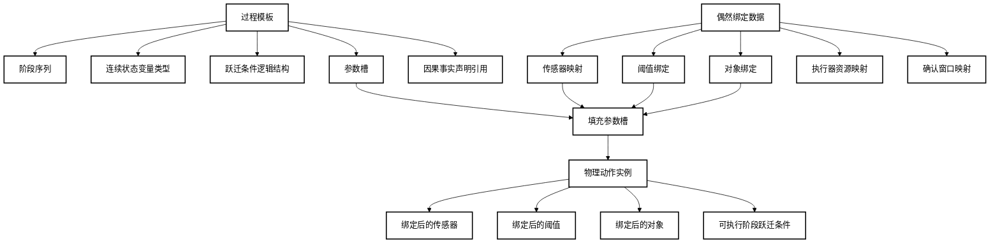
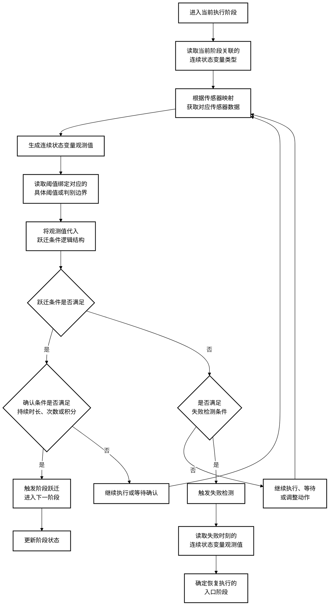
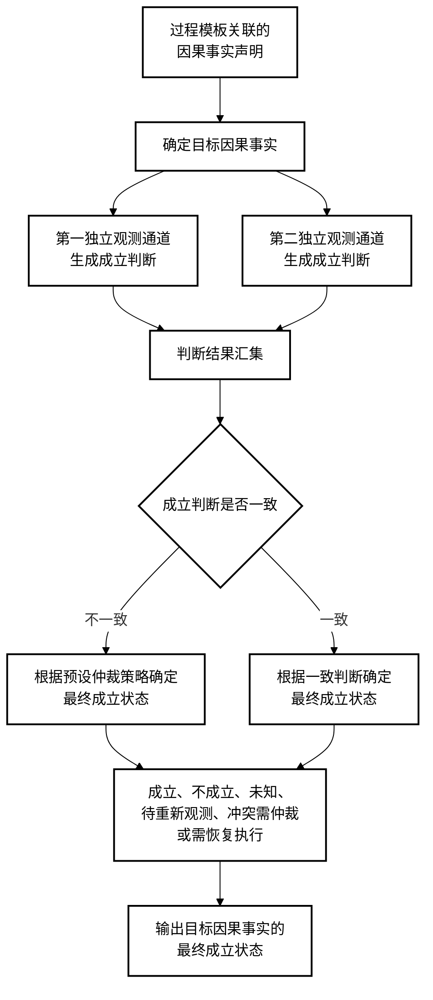
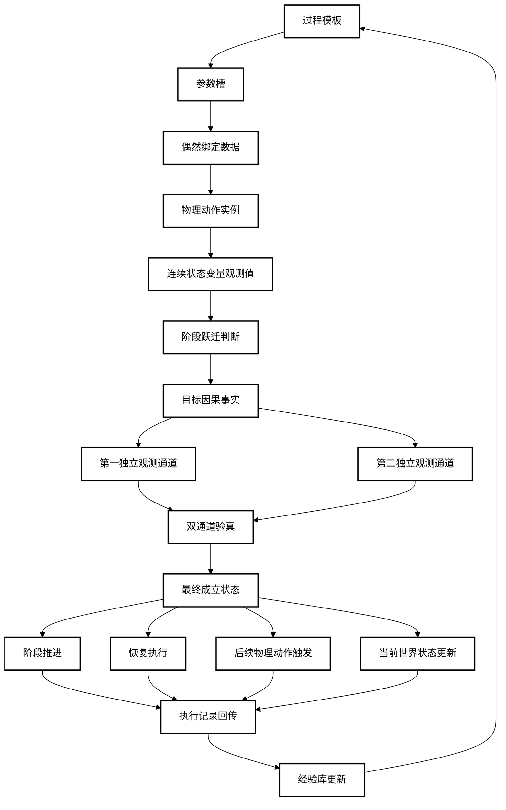
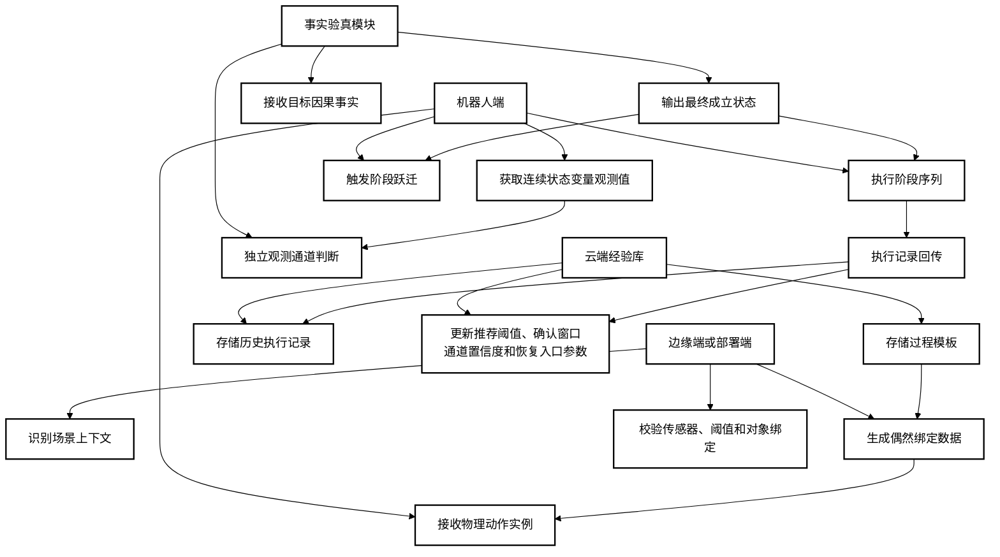

# P016 附图 Mermaid 稿

> 本文档用于集中存放说明书附图的 Mermaid 绘图稿。附图采用黑白线框风格，便于后续导出为正式附图或交由代理人重绘。

## 图 1 物理动作执行与经验复用方法的总体流程图

## 图 2 过程模板、偶然绑定数据和物理动作实例之间的数据结构关系图

## 图 3 必然层、因果层和偶然层的三层组织结构图

```mermaid
%%{init: {'flowchart': {'htmlLabels': true}, 'theme': 'base', 'themeVariables': { 'primaryColor':'#ffffff', 'primaryBorderColor':'#000000', 'background':'#ffffff', 'mainBkg':'#ffffff', 'clusterBkg':'#ffffff', 'clusterBorder':'#000000', 'lineColor':'#000000', 'tertiaryColor':'#ffffff', 'fontSize':'16px'}}}%%
graph TD
    A["必然层"] --> A1["物理动作不变过程结构"]
    A --> A2["过程模板"]
    A --> A3["阶段序列、连续状态变量类型<br/>跃迁条件逻辑结构、参数槽"]

    B["因果层"] --> B1["因果事实声明"]
    B --> B2["因果前提事实"]
    B --> B3["因果产出事实"]
    B --> B4["因果销毁事实"]

    C["偶然层"] --> C1["当前执行环境下的<br/>具体绑定数据"]
    C --> C2["传感器映射"]
    C --> C3["阈值绑定"]
    C --> C4["对象绑定"]
    C --> C5["确认窗口映射"]

    A --> D["物理动作实例生成"]
    B --> D
    C --> D
    D --> E["真实物理动作执行闭环"]

    style A fill:#ffffff,stroke:#000000,stroke-width:2px,color:#000000
    style A1 fill:#ffffff,stroke:#000000,stroke-width:2px,color:#000000
    style A2 fill:#ffffff,stroke:#000000,stroke-width:2px,color:#000000
    style A3 fill:#ffffff,stroke:#000000,stroke-width:2px,color:#000000
    style B fill:#ffffff,stroke:#000000,stroke-width:2px,color:#000000
    style B1 fill:#ffffff,stroke:#000000,stroke-width:2px,color:#000000
    style B2 fill:#ffffff,stroke:#000000,stroke-width:2px,color:#000000
    style B3 fill:#ffffff,stroke:#000000,stroke-width:2px,color:#000000
    style B4 fill:#ffffff,stroke:#000000,stroke-width:2px,color:#000000
    style C fill:#ffffff,stroke:#000000,stroke-width:2px,color:#000000
    style C1 fill:#ffffff,stroke:#000000,stroke-width:2px,color:#000000
    style C2 fill:#ffffff,stroke:#000000,stroke-width:2px,color:#000000
    style C3 fill:#ffffff,stroke:#000000,stroke-width:2px,color:#000000
    style C4 fill:#ffffff,stroke:#000000,stroke-width:2px,color:#000000
    style C5 fill:#ffffff,stroke:#000000,stroke-width:2px,color:#000000
    style D fill:#ffffff,stroke:#000000,stroke-width:2px,color:#000000
    style E fill:#ffffff,stroke:#000000,stroke-width:2px,color:#000000
```

## 图 4 阶段跃迁执行流程图

## 图 5 目标因果事实最终成立状态确定流程图

## 图 6 执行闭环与最终成立状态回流示意图

## 图 7 倒水动作过程模板示意图

```mermaid
%%{init: {'flowchart': {'htmlLabels': true}, 'theme': 'base', 'themeVariables': { 'primaryColor':'#ffffff', 'primaryBorderColor':'#000000', 'background':'#ffffff', 'mainBkg':'#ffffff', 'clusterBkg':'#ffffff', 'clusterBorder':'#000000', 'lineColor':'#000000', 'tertiaryColor':'#ffffff', 'fontSize':'16px'}}}%%
graph TD
    A["倒水动作过程模板"] --> B["定位阶段"]
    B --> C["倾斜阶段"]
    C --> D["保持流动阶段"]
    D --> E["回正阶段"]

    F["连续状态变量类型"] --> F1["壶嘴到杯口距离"]
    F --> F2["倾角"]
    F --> F3["流速"]
    F --> F4["液位高度"]

    G["参数槽"] --> G1["距离阈值标识"]
    G --> G2["最小流速阈值标识"]
    G --> G3["目标液位阈值标识"]
    G --> G4["杯对象引用"]
    G --> G5["水壶对象引用"]
    G --> G6["传感器引用"]

    H["因果事实声明"] --> H1["因果前提事实<br/>杯口已对准"]
    H --> H2["因果前提事实<br/>壶中有液体"]
    H --> H3["因果产出事实<br/>杯中液位达到目标高度"]
    H --> H4["因果销毁事实<br/>壶中液量保持原值不再成立"]

    B -.-> F1
    C -.-> F2
    C -.-> F3
    D -.-> F4
    G --> B
    G --> C
    G --> D

    style A fill:#ffffff,stroke:#000000,stroke-width:2px,color:#000000
    style B fill:#ffffff,stroke:#000000,stroke-width:2px,color:#000000
    style C fill:#ffffff,stroke:#000000,stroke-width:2px,color:#000000
    style D fill:#ffffff,stroke:#000000,stroke-width:2px,color:#000000
    style E fill:#ffffff,stroke:#000000,stroke-width:2px,color:#000000
    style F fill:#ffffff,stroke:#000000,stroke-width:2px,color:#000000
    style F1 fill:#ffffff,stroke:#000000,stroke-width:2px,color:#000000
    style F2 fill:#ffffff,stroke:#000000,stroke-width:2px,color:#000000
    style F3 fill:#ffffff,stroke:#000000,stroke-width:2px,color:#000000
    style F4 fill:#ffffff,stroke:#000000,stroke-width:2px,color:#000000
    style G fill:#ffffff,stroke:#000000,stroke-width:2px,color:#000000
    style G1 fill:#ffffff,stroke:#000000,stroke-width:2px,color:#000000
    style G2 fill:#ffffff,stroke:#000000,stroke-width:2px,color:#000000
    style G3 fill:#ffffff,stroke:#000000,stroke-width:2px,color:#000000
    style G4 fill:#ffffff,stroke:#000000,stroke-width:2px,color:#000000
    style G5 fill:#ffffff,stroke:#000000,stroke-width:2px,color:#000000
    style G6 fill:#ffffff,stroke:#000000,stroke-width:2px,color:#000000
    style H fill:#ffffff,stroke:#000000,stroke-width:2px,color:#000000
    style H1 fill:#ffffff,stroke:#000000,stroke-width:2px,color:#000000
    style H2 fill:#ffffff,stroke:#000000,stroke-width:2px,color:#000000
    style H3 fill:#ffffff,stroke:#000000,stroke-width:2px,color:#000000
    style H4 fill:#ffffff,stroke:#000000,stroke-width:2px,color:#000000
```

## 图 8 插入或装配动作过程模板示意图

```mermaid
%%{init: {'flowchart': {'htmlLabels': true}, 'theme': 'base', 'themeVariables': { 'primaryColor':'#ffffff', 'primaryBorderColor':'#000000', 'background':'#ffffff', 'mainBkg':'#ffffff', 'clusterBkg':'#ffffff', 'clusterBorder':'#000000', 'lineColor':'#000000', 'tertiaryColor':'#ffffff', 'fontSize':'16px'}}}%%
graph TD
    A["插入或装配动作过程模板"] --> B["对准阶段"]
    B --> C["接触阶段"]
    C --> D["插入阶段"]
    D --> E["到位确认阶段"]

    F["连续状态变量类型"] --> F1["姿态偏差"]
    F --> F2["接触力"]
    F --> F3["位移"]
    F --> F4["阻抗变化"]

    G["参数槽"] --> G1["插头对象引用"]
    G --> G2["插座对象引用"]
    G --> G3["力传感器引用"]
    G --> G4["接触阈值标识"]
    G --> G5["位移阈值标识"]

    H["因果事实声明"] --> H1["因果前提事实<br/>插座已识别"]
    H --> H2["因果前提事实<br/>插头已对准"]
    H --> H3["因果产出事实<br/>插头已到位"]
    H --> H4["因果销毁事实<br/>插头不再位于初始位置"]

    B -.-> F1
    C -.-> F2
    D -.-> F3
    D -.-> F4
    G --> B
    G --> C
    G --> D

    style A fill:#ffffff,stroke:#000000,stroke-width:2px,color:#000000
    style B fill:#ffffff,stroke:#000000,stroke-width:2px,color:#000000
    style C fill:#ffffff,stroke:#000000,stroke-width:2px,color:#000000
    style D fill:#ffffff,stroke:#000000,stroke-width:2px,color:#000000
    style E fill:#ffffff,stroke:#000000,stroke-width:2px,color:#000000
    style F fill:#ffffff,stroke:#000000,stroke-width:2px,color:#000000
    style F1 fill:#ffffff,stroke:#000000,stroke-width:2px,color:#000000
    style F2 fill:#ffffff,stroke:#000000,stroke-width:2px,color:#000000
    style F3 fill:#ffffff,stroke:#000000,stroke-width:2px,color:#000000
    style F4 fill:#ffffff,stroke:#000000,stroke-width:2px,color:#000000
    style G fill:#ffffff,stroke:#000000,stroke-width:2px,color:#000000
    style G1 fill:#ffffff,stroke:#000000,stroke-width:2px,color:#000000
    style G2 fill:#ffffff,stroke:#000000,stroke-width:2px,color:#000000
    style G3 fill:#ffffff,stroke:#000000,stroke-width:2px,color:#000000
    style G4 fill:#ffffff,stroke:#000000,stroke-width:2px,color:#000000
    style G5 fill:#ffffff,stroke:#000000,stroke-width:2px,color:#000000
    style H fill:#ffffff,stroke:#000000,stroke-width:2px,color:#000000
    style H1 fill:#ffffff,stroke:#000000,stroke-width:2px,color:#000000
    style H2 fill:#ffffff,stroke:#000000,stroke-width:2px,color:#000000
    style H3 fill:#ffffff,stroke:#000000,stroke-width:2px,color:#000000
    style H4 fill:#ffffff,stroke:#000000,stroke-width:2px,color:#000000
```

## 图 9 云端经验库、边缘端和机器人端协同实施示意图

