# P017 附图 Mermaid 稿

> 本文档用于集中存放说明书附图的 Mermaid 绘图稿。附图采用黑白线框风格，便于后续导出为正式附图或交由代理人重绘。图中文字仅用于说明数据、模块和步骤之间的关系，不限定本发明保护范围。

## 图 1 跨空间跨本体真实经验迁移执行方法总体流程图

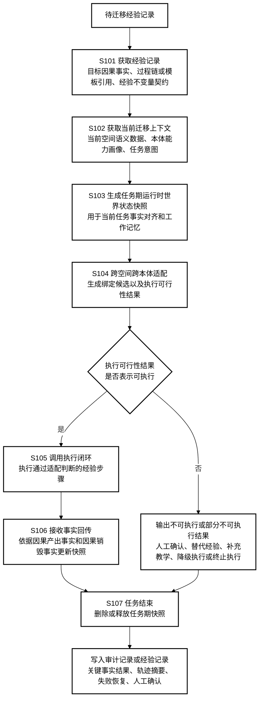

## 图 2 经验记录、经验不变量契约、当前空间语义数据、本体能力画像和任务期运行时世界状态快照之间的数据关系图

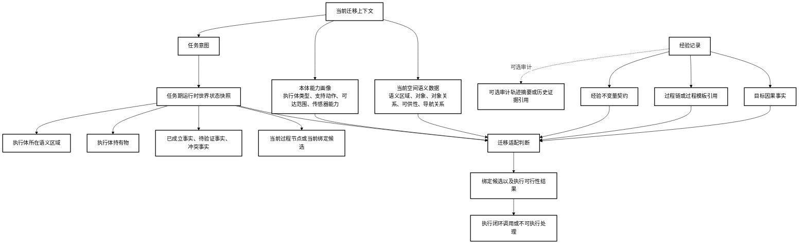

## 图 3 经验不变量契约的结构示意图

```mermaid
%%{init: {'flowchart': {'htmlLabels': true}, 'theme': 'base', 'themeVariables': { 'primaryColor':'#ffffff', 'primaryBorderColor':'#000000', 'background':'#ffffff', 'mainBkg':'#ffffff', 'clusterBkg':'#ffffff', 'clusterBorder':'#000000', 'lineColor':'#000000', 'tertiaryColor':'#ffffff', 'fontSize':'16px'}}}%%
graph TD
    A["经验不变量契约"] --> B["拓扑关系不变量"]
    A --> C["试探方向与物理约束不变量"]
    A --> D["事实终止条件不变量"]
    A --> E["不可迁移内容排除标记"]

    B --> B1["执行体到达语义区域"]
    B --> B2["末端执行器持有对象"]
    B --> B3["对象开口与目标对象对齐"]
    B --> B4["工具作用部位与目标作用部位满足相对关系"]

    C --> C1["动作方向"]
    C --> C2["允许运动边界或最大运动限制"]
    C --> C3["安全、负载、接触力或姿态限制"]
    C --> C4["本体约束"]

    D --> D1["目标因果事实成立"]
    D --> D2["连续状态变量满足阈值"]
    D --> D3["独立观测通道判断一致"]
    D --> D4["人工确认或执行闭环最终成立状态"]

    E --> E1["不作为迁移必要内容<br/>绝对坐标"]
    E --> E2["不作为迁移必要内容<br/>机器人专用关节角"]
    E --> E3["不作为迁移必要内容<br/>固定执行时长"]
    E --> E4["不作为迁移必要内容<br/>单一本体轨迹或固定绑定值"]

    classDef bw fill:#ffffff,stroke:#000000,stroke-width:2px,color:#000000;
    class A,B,C,D,E,B1,B2,B3,B4,C1,C2,C3,C4,D1,D2,D3,D4,E1,E2,E3,E4 bw;
```

## 图 4 基于经验不变量契约和当前迁移上下文生成绑定候选以及执行可行性结果的流程图

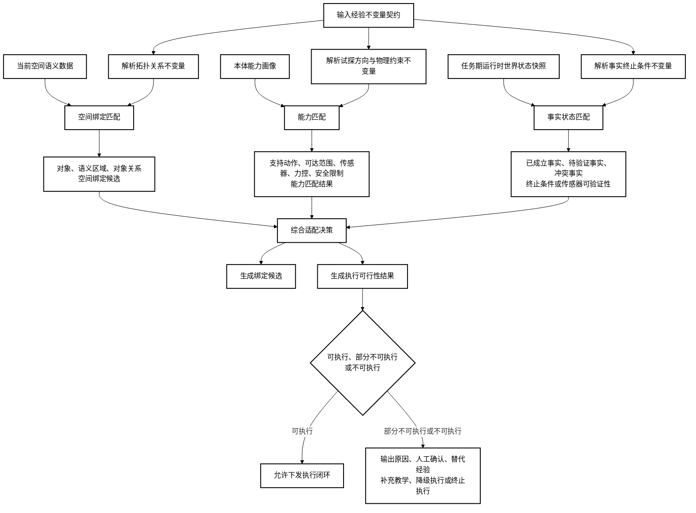

## 图 5 执行闭环返回因果产出事实和因果销毁事实并更新任务期运行时世界状态快照的示意图

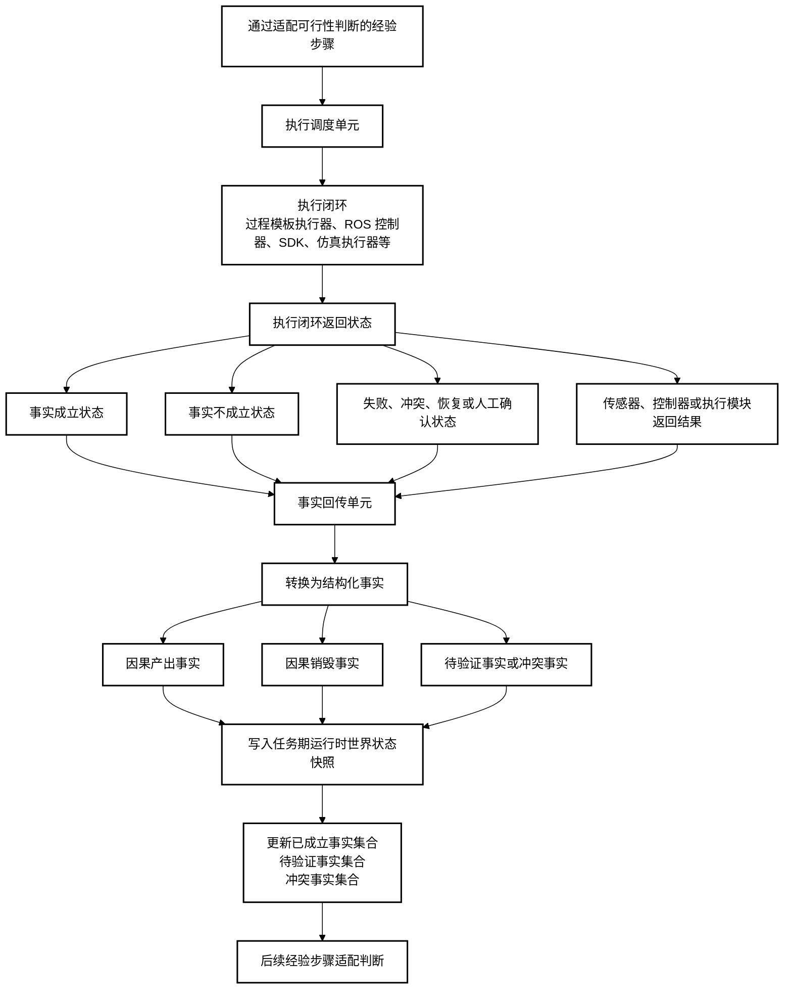

## 图 6 任务期运行时世界状态快照释放及审计记录保留的示意图

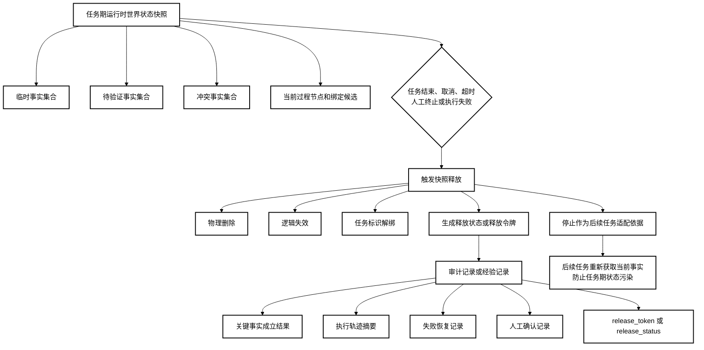

## 图 7 迁移适配控制器的系统结构和内部数据流示意图

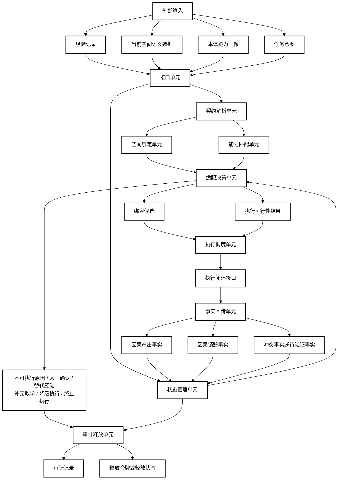

## 图 8 云端经验库、边缘迁移适配器和机器人端执行闭环协同实施示意图

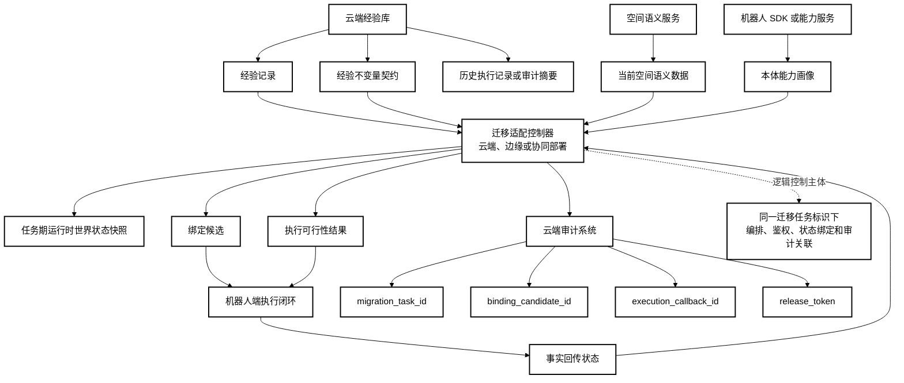

## 图 9 不可执行或部分不可执行结果触发人工确认、替代经验搜索或补充教学的流程图

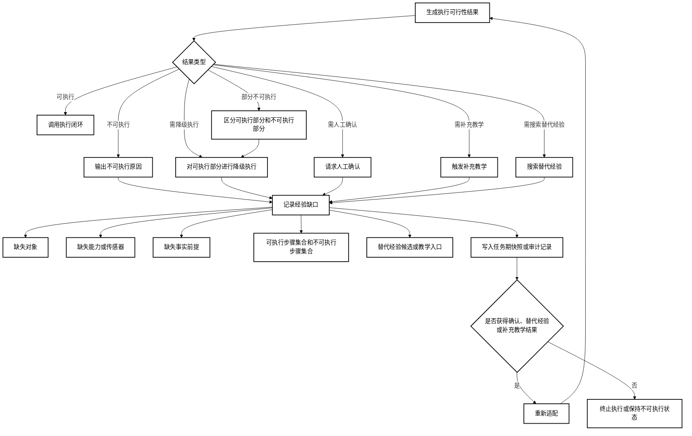

## 图 10 目标因果事实反推前提链的可选实施示意图

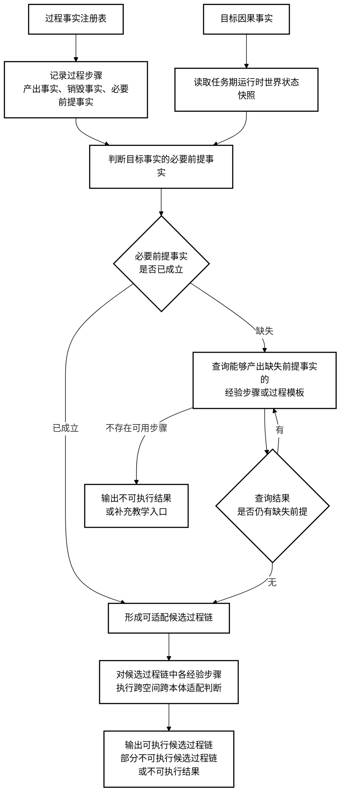

## 图 11 显式空间路线保真与因果校验的可选实施示意图

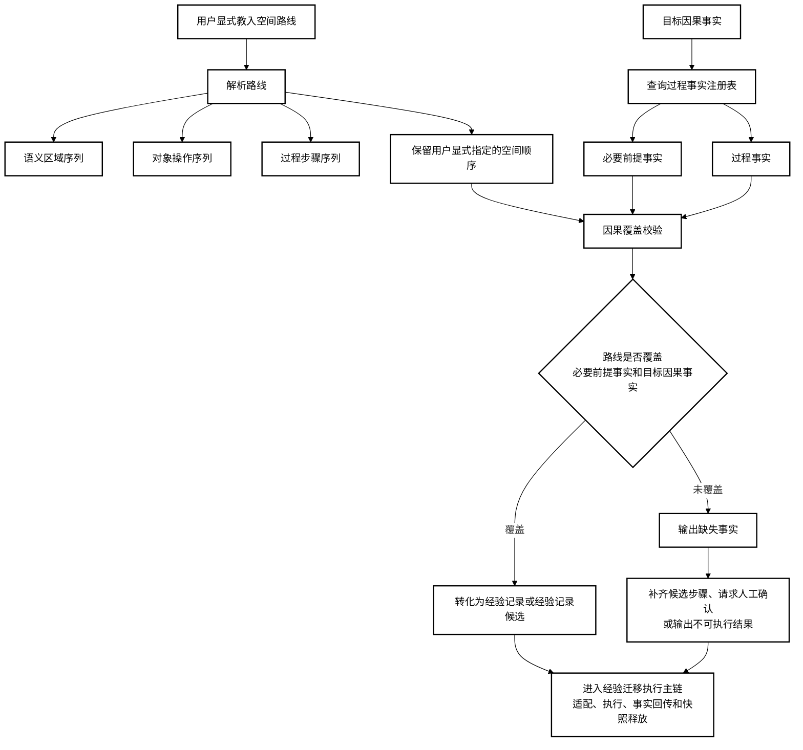

## 图 12 执行闭环开放接口的可选实施示意图

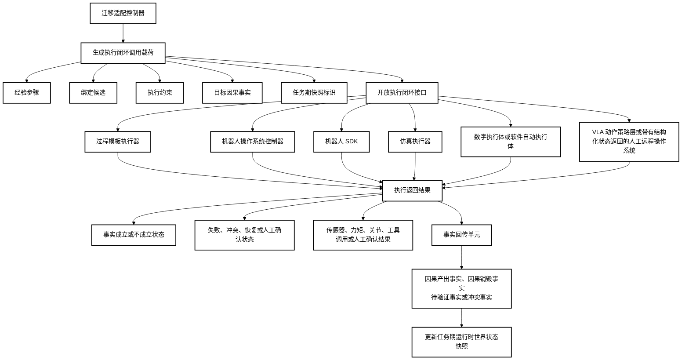

## 图 13 运行时冲突处理与重新适配的可选实施示意图

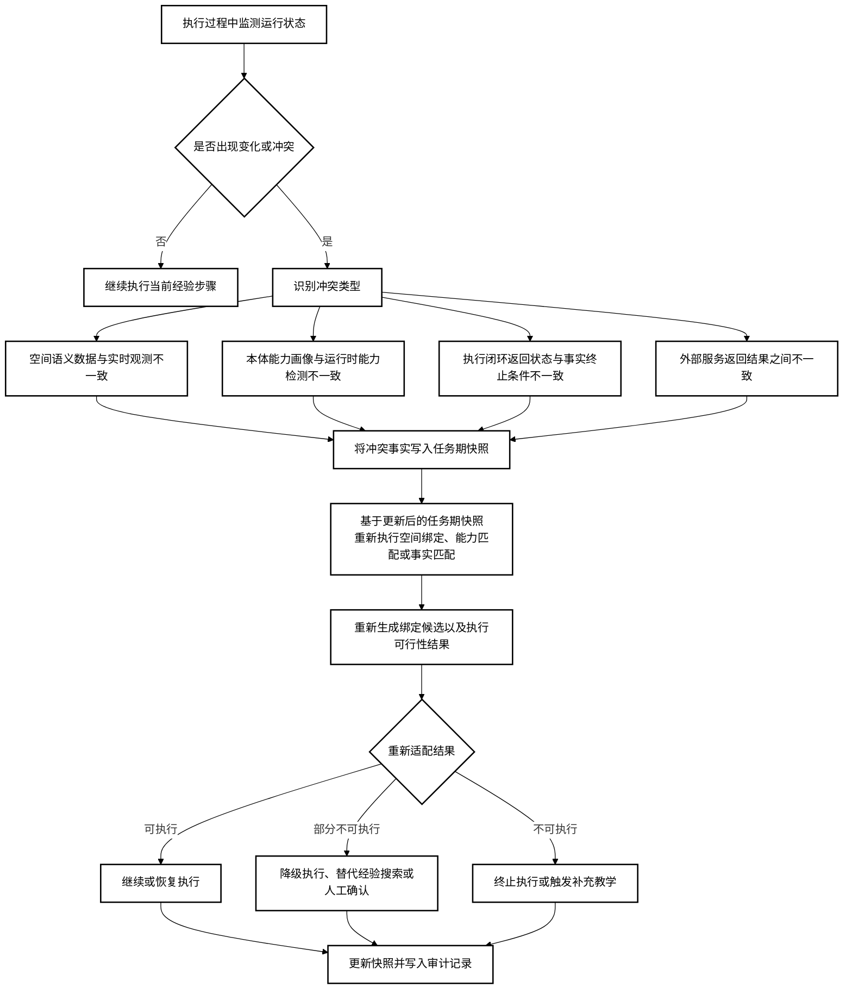

## 图 14 经验不变量契约生成的可选实施示意图

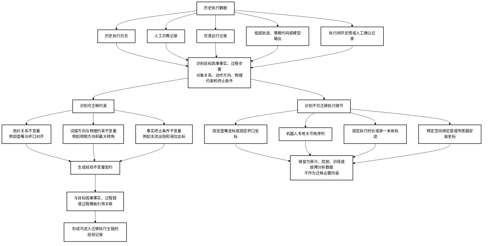
