# 附图 Mermaid 稿

> 本文档用于集中存放说明书附图的 Mermaid 绘图稿。附图采用黑白线框风格，便于后续导出为正式附图或交由代理人重绘。

> 附图中的节点文字、步骤编号、字段表达和部署位置仅为示例性说明；实际实施方式可采用不同名称、编号、消息格式、字段结构或部署结构。

## 图 1 状态优先任务交互仲裁方法总体流程图

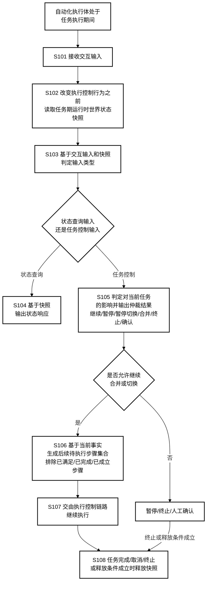

## 图 2 系统结构图

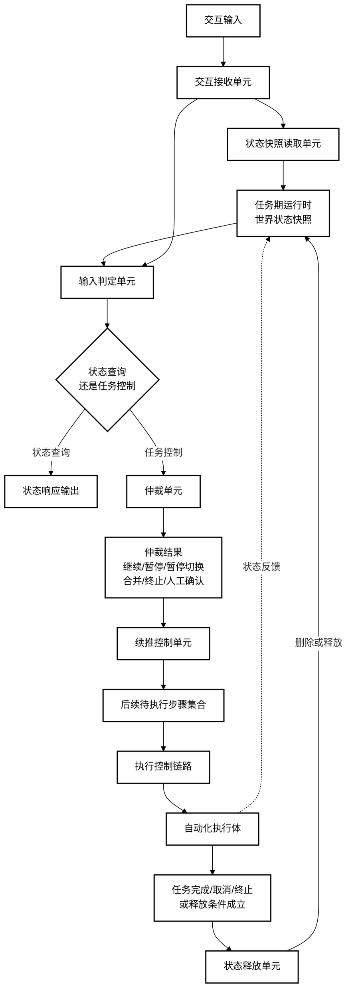

## 图 3 任务期运行时世界状态快照数据结构示意图

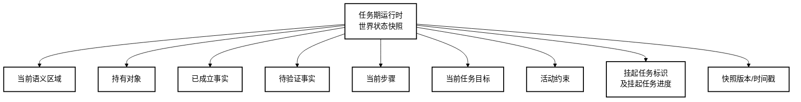

## 图 4 状态查询输入处理流程图

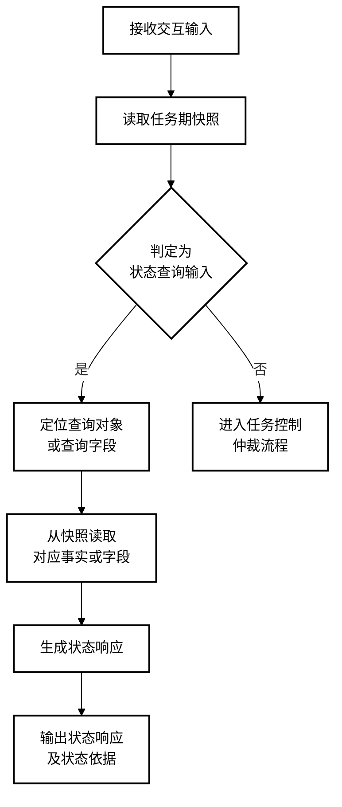

## 图 5 任务控制输入仲裁流程图

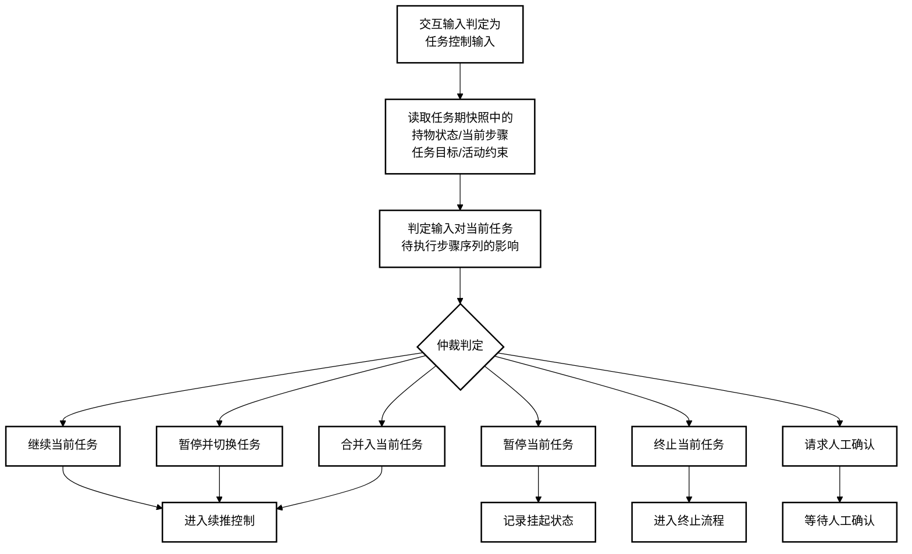

## 图 6 基于当前事实裁剪后续步骤流程图

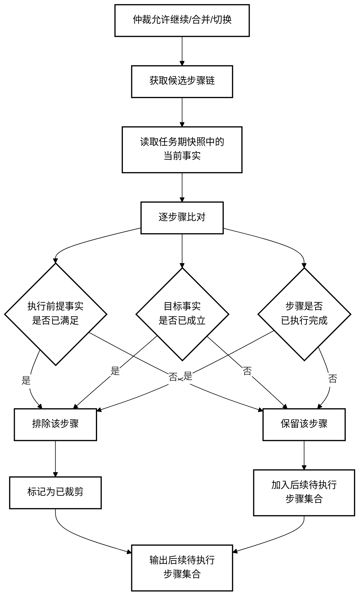

## 图 7 当前持有对象与新任务目标冲突仲裁示意图

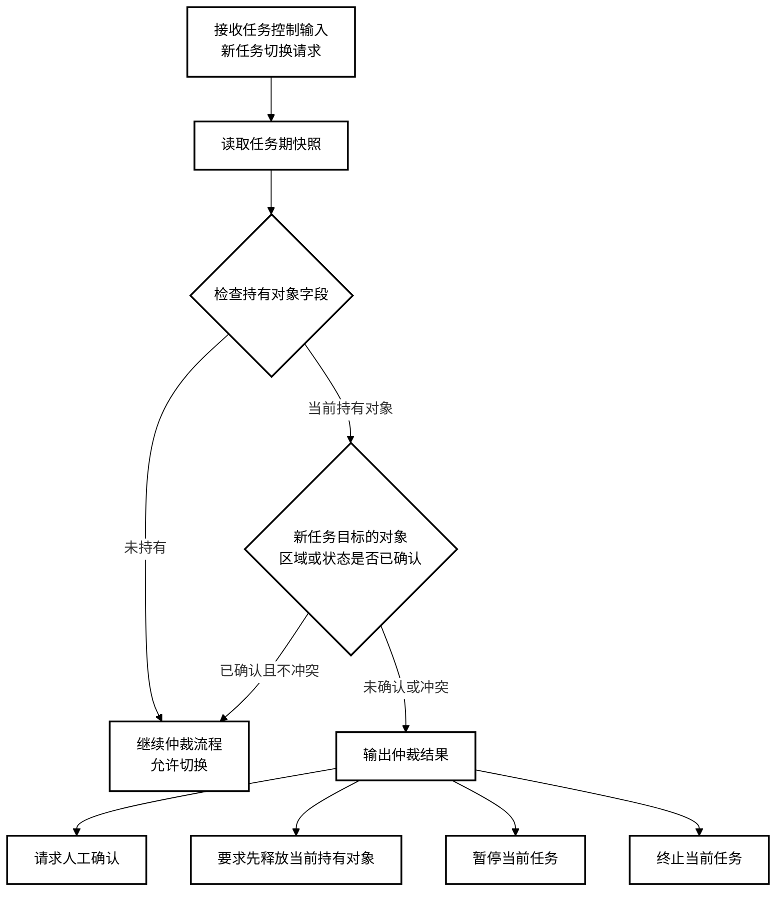

## 图 8 任务暂停、恢复与快照续推示意图

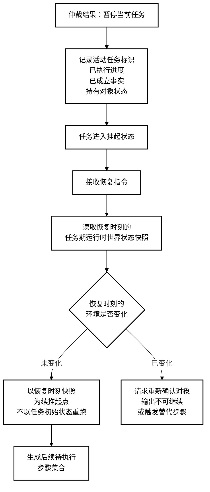

## 图 9 约束追加输入和教学输入合并流程图

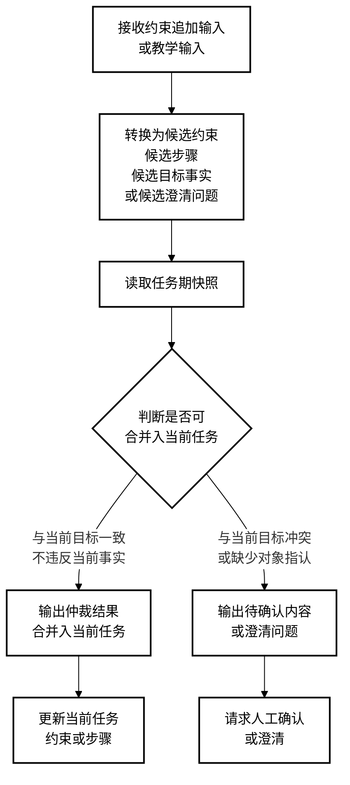

## 图 10 云端、边缘端、端侧与执行体本体的分布式部署示意图

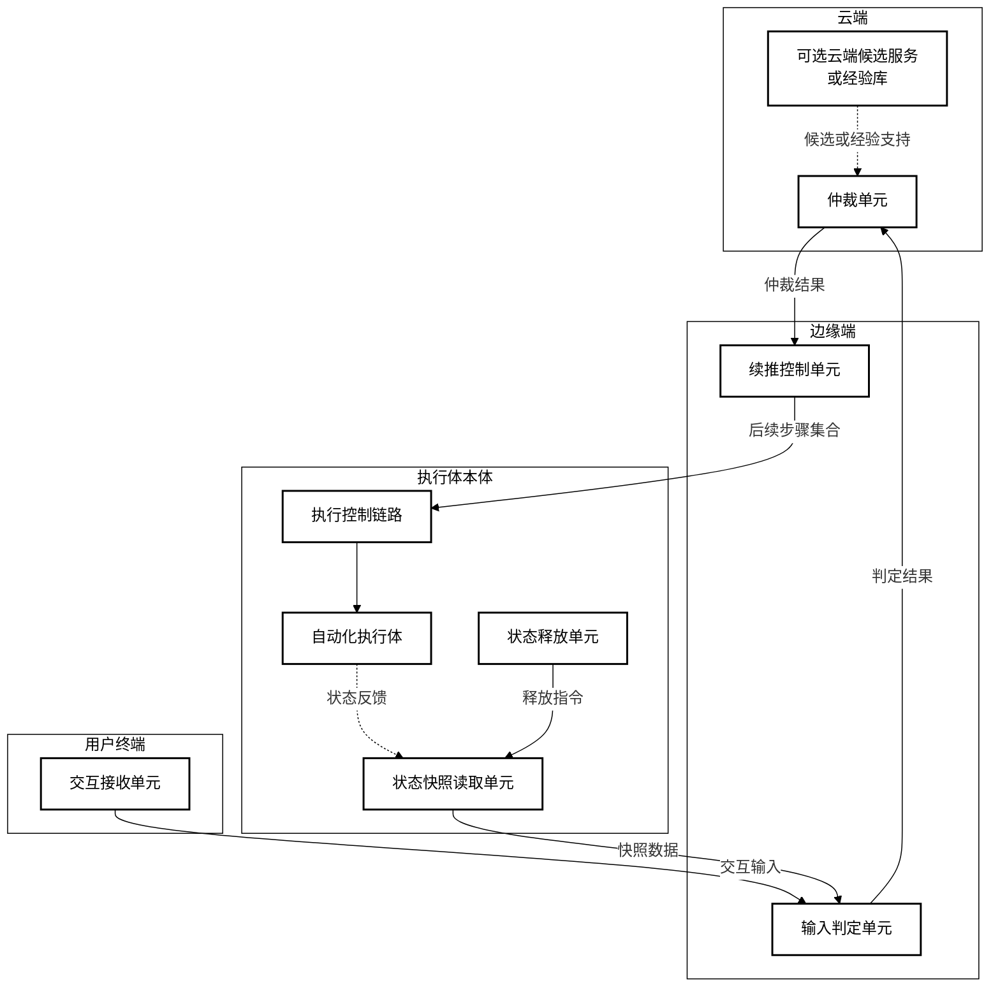

## 图 11 任务期快照释放与防状态污染示意图

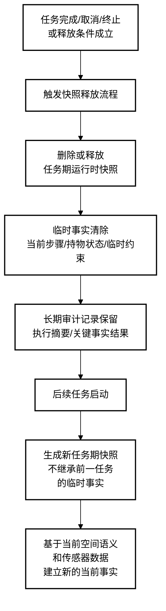

## 图 12 可选交互层、端侧概念内化与云端候选服务边界图

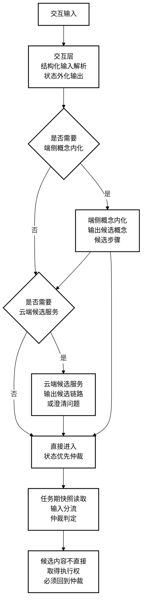
