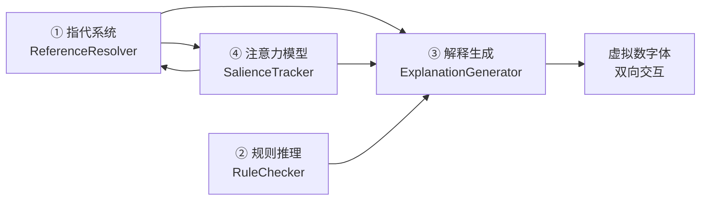
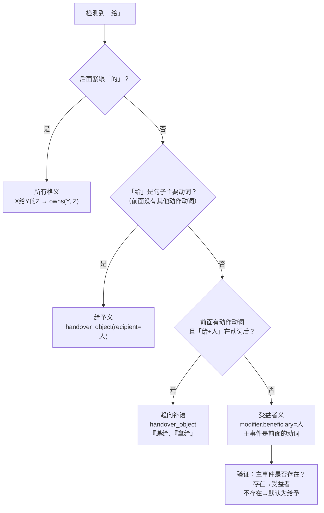

# RELL 架构缺口补全 — 指代·规则·解释·注意力

版本：v2 / 2026-07-21
状态：架构母稿
目的：系统定义当前 RELL 认知架构中尚未覆盖的重要能力模块，
     使工程团队明确知道下一步要建什么、为什么建、接口怎么定。

---

## 总览

| 缺口 | 核心解决的问题 | 在流水线中的位置 | 紧急度 |
|---|---|---|---|
| ① 指代系统 | 「那个红的」「刚才的地方」「另一个」 | 事件识别→角色绑定之间 | 极高 |
| ② 规则推理 | 「超过60度不能手拿」「易碎品轻放」 | 因果图编译→P018仲裁之间 | 高 |
| ③ 解释生成 | 「我为什么这么做」「哪里不确定」 | P018/P016 → 人类交互输出 | 中 |
| ④ 注意力模型 | 当前应该「关注」哪个实体 | 贯穿全流水线 | 中 |

---

## 缺口一：指代系统（Reference Resolution）

### 1.1 为什么需要独立模块

当前 `_resolve_pronouns()` 只处理了最基础的「它/这个/那个」指代，且逻辑是：往前找最近的一个 graspable 实体。这在复杂对话中远远不够。

日常对话中大量出现的指代类型：

| 表达 | 类型 | 解析需要的知识源 |
|---|---|---|
| 「拿**它**」 | 代词 | 当前对话焦点 |
| 「拿**这个**/**那个**」 | 指示代词 | 近指/远指 + 视觉焦点 |
| 「**刚才那个**」 | 时间限定 | 对话历史 + 事件时序 |
| 「**同样的**/**一样的**」 | 类比 | 概念属性匹配 |
| 「**另一个**/**别的**」 | 对比排除 | 当前焦点以外的实体 |
| 「**第一个**/**最后一个**」 | 序数 | 排序标准（空间/时间/属性） |
| 「**红的那个**」 | 属性限定 | 感知属性过滤 |
| 「**你拿的那个**」 | 事件限定 | 回溯事件角色 |
| 「**之前放杯子的地方**」 | 关系+事件复合 | 事件+角色+空间复合查询 |
| 「**那个放苹果的桌子**」 | 关系限定 | 当前事实查询 |
| 「**他/他们**」 | 人称 | 场景中的人类参与者 |
| 「**那里/这边**」 | 地点指代 | 空间参考 + 方向 |

### 1.2 架构位置

```
语言输入
  → 事件识别（event_mentions）
  → 物体识别（object_mentions）
  → 【NEW】ReferenceResolver
      ├── 识别所有指代表达（代词/指示/限定/零形）
      ├── 为每个指代生成候选列表 + 评分
      └── 输出已解析的实体列表（带 provenance）
  → 角色绑定（roles）
  → ...
```

### 1.3 ReferenceResolver 接口设计

```python
def resolve_references(
    text: str,
    objects: list[dict[str, Any]],        # 本轮识别出的实体
    context_entities: list[dict[str, Any]], # 上下文中的实体（含历史焦点）
    events: list[dict[str, Any]],          # 本轮已识别的事件
    world_facts: list[dict[str, Any]],     # 当前世界事实（用于关系查询）
    source: str = "language_composition",
) -> ReferenceResolution:
    ...
```

### 1.4 输出结构

```json
{
  "schema_version": "1.0.0",
  "resolved_references": [
    {
      "surface": "它",
      "span": [12, 13],
      "reference_type": "pronoun",
      "candidates": [
        {
          "entity_ref": "entity_cup_01",
          "score": 0.92,
          "provenance": {
            "method": "dialogue_focus",
            "basis": "most_recent_mentioned_graspable_entity",
            "evidence": ["preceding_utterance: '拿杯子'"]
          }
        },
        {
          "entity_ref": "entity_bottle_02",
          "score": 0.35,
          "provenance": {
            "method": "visual_salience",
            "basis": "closest_to_gripper",
            "evidence": ["visual_focus: 0.6m_ahead"]
          }
        }
      ],
      "selected": "entity_cup_01",
      "unique": true,
      "requires_confirmation": false
    },
    {
      "surface": "红的那个",
      "span": [18, 22],
      "reference_type": "attribute_limited",
      "candidates": [
        {
          "entity_ref": "entity_cup_03",
          "score": 0.87,
          "provenance": {
            "method": "attribute_match",
            "basis": "observed_color=red",
            "evidence": ["visual_observation: color_red"],
            "matched_constraints": [
              {"attribute": "color", "surface": "红", "value": "red"}
            ]
          }
        }
      ],
      "selected": "entity_cup_03",
      "unique": true,
      "requires_confirmation": false
    }
  ],
  "unresolved": [
    {
      "surface": "那个地方",
      "type": "location_deictic",
      "reason": "no_spatial_reference_in_current_context"
    }
  ],
  "global_focus_update": {
    "new_focus": "entity_cup_01",
    "decay_previous": ["entity_plate_05", "entity_bottle_02"]
  }
}
```

### 1.5 指代消解的六条优先级规则

1. **对话焦点优先**：当前/前一句作为主语或主题的实体优先
2. **属性匹配**：如果有属性限定词（红的、大的），按感知属性过滤
3. **事件角色回溯**：如果有限定事件（「你拿的那个」），回溯事件的角色绑定
4. **空间近邻**：无其他信息时，按空间距离排序
5. **概念匹配**：动词对 theme 的概念约束可以排除不兼容实体
6. **时序衰减**：超过 N 轮对话或 N 次操作后，实体退出焦点

### 1.6 零形指代（Zero Anaphora）

中文中最隐蔽但最常见的指代——省略主语/宾语但不影响理解：

| 句子 | 零形成分 |
|---|---|
| 「（你）把杯子拿过来，（你）放到桌子上」 | 省略主语「你」 |
| 「杯子拿过来，（把杯子）放到桌子上」 | 省略宾语「杯子」 |

当前 `_propagate_event_frame_roles()` 已经处理了一部分（把前一个事件的 theme 继承到后一个事件），但只覆盖了 `sequence` 关系，且缺乏类型安全的校验。

零形指代应该统一在 ReferenceResolver 中处理，规则：

1. 同一话语链中，前一个事件的主题默认继承到后一个事件
2. 但如果后一个事件的动词概念约束不兼容，生成 InquiryContract
3. 跨句零形指代需要额外的对话焦点衰减策略

### 1.7 需要新增的数据结构

```python
@dataclass
class ReferenceResolution:
    resolved: list[ResolvedReference]
    unresolved: list[UnresolvedReference]
    focus_update: FocusUpdate

@dataclass
class ResolvedReference:
    surface: str
    span: tuple[int, int]
    reference_type: str  # pronoun / demonstrative / attribute_limited / event_limited / relational / analogical / ordinal
    selected_ref: str
    candidates: list[Candidate]
    unique: bool
    requires_confirmation: bool
    provenance: dict

@dataclass
class Candidate:
    entity_ref: str
    score: float
    provenance: dict

@dataclass
class FocusUpdate:
    new_focus: str | None
    decay_previous: list[str]
```

---

## 缺口二：规则推理系统（Rule-Based Reasoning）

### 2.1 为什么需要

生产场景中存在大量无法用「概念定义」或「动作原语契约」表达的约束性知识：

| 规则类型 | 示例 | 在哪用 |
|---|---|---|
| 安全规则 | 「超过60度不能手拿」「化学品戴手套」 | 动作选择前做约束检查 |
| 操作规范 | 「液体不能超过容器80%」「重物双手搬运」 | 执行参数约束 |
| 流程规则 | 「先刷卡再进门」「上完厕所要洗手」 | 过程模板的附加约束 |
| 空间规则 | 「工具用完归位」「通道不能堆放」 | 事后验真/违规检测 |
| 偏好规则 | 「咖啡杯和茶杯分开摆」「重的在下面」 | 排列策略 |
| 法律合规 | 「药品不能和食品混放」「隐私区域不能进」 | 授权边界 |

这类知识的特点是：
- **不依赖于特定实例**——「超过60度」适用于所有物体，不特定于某个杯子
- **可以被覆盖**——规则有优先级，人类明确指令可以覆盖默认规则
- **可溯源**——每条规则来自安全规范、SOP 或人类教授

### 2.2 架构位置

```
语言输入 → RelationHypothesisGenerator → 因果图编译
                                               ↓
                                        【NEW】RuleChecker
                                               ↓
                                          P018 仲裁
                                               ↓
                                          P016 执行
                                               ↓
                                        【NEW】RuleViolationDetector ← 验真结果
```

### 2.3 RuleSet 结构

```json
{
  "rule_id": "safety_high_temperature_no_bare_hand",
  "rule_type": "prohibition",
  "priority": 90,
  "scope": ["kitchen", "factory_floor", "laboratory"],
  "trigger": {
    "event_type": "grasp_object",
    "condition": {
      "all": [
        {
          "predicate": "temperature",
          "subject_role": "theme",
          "operator": ">",
          "value": 60,
          "unit": "celsius"
        },
        {
          "predicate": "contact_method",
          "subject_role": "executor",
          "operator": "==",
          "value": "bare_gripper"
        }
      ]
    }
  },
  "consequence": {
    "action": "block_execution",
    "fallback": "request_tool_or_protection",
    "explanation": "温度超过60度，不能徒手拿取，请使用隔热工具"
  },
  "source": "factory_safety_protocol_v3",
  "override_allowed": true,
  "override_condition": "human_explicit_authorization_required"
}
```

### 2.4 规则类型枚举

| 规则类型 | 含义 | 执行影响 |
|---|---|---|
| `prohibition` | 禁止执行 | 阻止事件 |
| `obligation` | 必须执行 | 强制添加事件 |
| `constraint` | 约束参数 | 限制参数范围 |
| `precondition` | 前提条件 | 事件前增加检查 |
| `postcondition` | 事后检查 | 事件后增加验真 |
| `ordering` | 顺序约束 | 事件A必须在事件B之前 |
| `parameter_default` | 参数默认值 | 未指定时填充默认值 |

### 2.5 规则的来源与生命周期

| 来源 | 存储位置 | 持久性 | 可被覆盖 |
|---|---|---|---|
| 出厂安全规则 | `rules/builtin/` | 永久 | 仅管理员 |
| 场景 SOP | `rules/site_{id}/` | 与场景绑定 | 场景负责人 |
| 人类教学 | `rules/taught/` | 用户可删除 | 随时可覆盖 |
| 临时指令 | `context_rules/` | 当前会话 | 立即生效 |

### 2.6 规则冲突处理

当多条规则同时触发且有冲突时：

```
规则 A（priority=90）: 「超过60度不能手拿」
规则 B（priority=70）: 「接到紧急命令必须立即转移所有物品」

→ 规则 A 优先级高，阻止手拿
→ 但如果有更高级的紧急规则 C（priority=100）: 「紧急情况下按人类实时指令优先」
→ 人类说「不管了直接拿」→ C 覆盖 A
```

规则冲突的仲裁协议：

```text
IF 多条规则同时触发 AND 结论冲突
  → 按 priority 排序
  → 相同 priority 按 specificity（条件越具体优先级越高）
  → 仍冲突 → generate InquiryContract
```

### 2.7 与经验合同和动作原语契约的关系

| 概念 | 与规则推理的关系 |
|---|---|
| 动作原语契约（requires/projects/verification） | 契约表达「执行这个操作必须/会/验什么」 |
| 规则推理 | 表达「当前场景下**允不允许**执行这个操作」 |
| 经验合同 | 规则可以触发经验召回（「超过60度→改用水冷夹爪」） |

---

## 缺口三：解释生成层（Explanation / Justification）

### 3.1 为什么需要

P020 第12节定义了「反向翻译」的概念，但没有落地。现在即使架构全通了，机器人也只是沉默地执行。用户验收标准明确要求：

> **虚拟数字体能告诉我他有什么地方不明白了**

当前能力与目标之间的差距：

| 机器人状态 | 当前行为 | 期望行为 |
|---|---|---|
| 理解完整 | 沉默执行 | 「好的，我把杯子放到操作台B上」 |
| 部分理解 | 卡住/报错 | 「我找遍了操作台B和C，都没找到杯子，请问之前放在哪里了？」 |
| 有歧义 | 随便选一个 | 「您说的'放'——是放在台面上还是放进抽屉里？」 |
| 推理出默认值 | 沉默地用默认 | 「操作台B默认放到台面上，对吗？」 |

### 3.2 架构位置

```
RCIR Bundle（因果图 + 事实账本 + 证据包装）
  →
  P018 执行（产生执行轨迹）
  →
  P016 验真（产生事实变化）
  →
  【NEW】ExplanationGenerator
      ├── 读取当前 RCIR Bundle
      ├── 读取执行轨迹摘要
      ├── 读取未决认知缺口（InquiryContract）
      └── 生成自然语言解释
  →
  人类
```

### 3.3 ExplanationGenerator 接口

```python
def generate_explanation(
    rcir_bundle: dict[str, Any],
    execution_trace: list[dict[str, Any]] | None = None,
    pending_inquiries: list[dict[str, Any]] | None = None,
    mode: str = "proactive",  # proactive | on_request | error
) -> str:
    ...
```

### 3.4 五种解释模式

#### 模式 A：执行前确认

```
触发条件：目标任务已编译完成，但存在推理默认值
输出：
  「我理解您的意思是：
    1. 把杯子放到操作台B（台面上）
    2. 然后拿苹果
    当前杯子已在手中，操作台B在您左侧3米处。
    现在执行，可以吗？」
```

#### 模式 B：执行中状态

```
触发条件：人类询问「在干什么」
输出：
  「我正在前往操作台B，手里拿着杯子。
    距目的地还有约2米。
    预计5秒后到达。」
```

#### 模式 C：歧义提问

```
触发条件：RelationHypothesisGenerator 产出多个等优先级候选
输出：
  「您说'放在操作台B'——我看到了两个可能的位置：
    A. 操作台B的台面上（承托面）
    B. 操作台B的抽屉里（储物空间）
    您是指哪一个？」
```

#### 模式 D：无法执行

```
触发条件：规则禁止或前提不满足
输出：
  「我无法执行'放到操作台B上'，因为：
    - ❌ 杯子里有热水（温度65°C）
    - 操作台B的台面是木质的，不耐热
    建议：先把水倒掉，或者使用隔热垫。」
```

#### 模式 E：执行完成总结

```
触发条件：任务完成
输出：
  「已完成：杯子已放到操作台B的台面上。
   用时：12秒。
   期间没有异常。
   还有什么需要帮忙的吗？」
```

### 3.5 反事实解释（为什么不做 X）

当人类问「为什么不放在操作台C上？」，解释生成器需要回答：

```
输入：对比目标 = 操作台C
查询：
  1. 操作台C 当前是否 support_object？→ 否（上面堆满了东西）
  2. 操作台C 是否 reachable？→ 是但路径被挡住了
  3. 是否有规则禁止？→ 否
输出：
  「操作台C目前堆满了工具箱和零件，没有可用于放置杯子的台面空间。
    操作台B是唯一有足够空间且无障碍的台面。」
```

这需要解释生成器能**对未执行的替代方案做条件查询**，然后对比当前选择。

---

## 缺口四：注意力与显著性模型（Attention / Salience Model）

### 4.1 为什么需要

人类对话中有「焦点」——当你说「把它拿过来」时，听话者会自动将注意力集中到「当前最相关」的那个实体上。但当前 RELL 没有这个机制。

没有注意力模型导致的问题：

| 场景 | 问题 |
|---|---|
| 场景中有 20 个物体，用户说「拿过来」 | 不知道哪个 |
| 用户刚说完「桌上有三个杯子」，然后说「把它洗了」 | 不知道哪个「它」 |
| 用户从多个方向指代 | 没有「当前最可能是哪个」的排序 |
| 机器人转头后 | 视觉焦点变了，但交互焦点没变 |

### 4.2 注意力的层级

| 层级 | 作用域 | 内容 | 衰减策略 |
|---|---|---|---|
| 全局焦点 | 整个会话 | 当前任务的目标和主题 | 任务完成后清除 |
| 对话焦点 | 最近 3-5 轮对话 | 最近提到的实体、事件 | 每轮对话衰减 |
| 操作焦点 | 当前执行步骤 | 当前操作的对象、目的地 | 步骤完成后转移 |
| 视觉焦点 | 当前视野 | 视场中心/机械臂附近的实体 | 随视角移动 |

### 4.3 显著性评分公式

```
salience(entity) =
    w1 * dialogue_recency(entity)     — 最近被提到的次数衰减
  + w2 * operation_involvement(entity) — 是否正在/刚被操作
  + w3 * visual_salience(entity)       — 视觉中心度/大小/运动
  + w4 * task_relevance(entity)        — 是否在当前因果图中
  + w5 * concept_match(entity, event)  — 是否满足当前动词的概念约束
```

每个权重可动态调整。例如当用户说「拿」时，`w5`（graspable 可供性匹配）的权重提高，过滤掉非 graspable 实体。

### 4.4 SalienceTracker 接口

```python
class SalienceTracker:
    def __init__(self):
        self.global_focus: FocusState = FocusState()
        self.dialogue_focus: FocusState = FocusState()
        self.operational_focus: FocusState = FocusState()
        self.visual_focus: FocusState = FocusState()

    def update_from_utterance(
        self,
        utterance: str,
        parsed: dict[str, Any],
        entities: list[dict[str, Any]],
    ) -> None:
        """在每轮语言输入后更新所有焦点层级。"""
        ...

    def update_from_execution(
        self,
        operator: str,
        role_bindings: dict[str, Any],
    ) -> None:
        """在每步执行后更新操作焦点。"""
        ...

    def update_from_visual(
        self,
        gaze_direction: tuple[float, float, float],
        fov_entities: list[str],
        gripper_position: tuple[float, float, float],
    ) -> None:
        """在视觉更新后更新视觉焦点。"""
        ...

    def get_salient_entities(
        self,
        top_k: int = 5,
        concept_filter: str | None = None,
    ) -> list[ScoredEntity]:
        """获取当前最显著的 N 个实体，可选按概念过滤。"""
        ...

    def get_focus_entity(
        self,
        reference_type: str = "pronoun",
    ) -> str | None:
        """获取当前最可能的指代目标。"""
        ...
```

### 4.5 焦点更新事件

| 触发事件 | 焦点层级 | 更新内容 |
|---|---|---|
| 用户提到实体 | 对话焦点 | 该实体 +5，其他 -1 |
| 机器人抓取实体 | 操作焦点 | 该实体设为当前操作对象 |
| 机器人释放实体 | 操作焦点 | 清除操作焦点 |
| 机器人转头 | 视觉焦点 | 新视野内实体 +3，旧视野外 -2 |
| 任务完成 | 全局焦点 | 清除，新任务实体设为全局焦点 |
| 新轮对话 | 所有层级 | 全局 * 0.95，对话 * 0.8 |

### 4.6 与指代系统协同

```
用户说：「把它拿过来」
  → 1. ReferenceResolver 识别出「它」是一个代词指代
  → 2. 查询 SalienceTracker.get_focus_entity(reference_type="pronoun")
  → 3. 返回当前实体（如 entity_cup_01）+ 评分
  → 4. 如果评分 > 阈值，自动绑定；否则生成 InquiryContract
```

---

## 附录：四个缺口的实现优先级与依赖关系



### 实施建议

| 阶段 | 内容 | 预估工时 | 前提 |
|---|---|---|---|
| 第一阶段 | 指代系统基础版（代词+属性限定+序数） | 1-2周 | 已有 event_mentions / object_mentions |
| 第二阶段 | 注意力模型基础版（对话焦点 + 操作焦点） | 1周 | 第一阶段 |
| 第三阶段 | 规则推理引擎（RuleSet 定义 + 执行前检查） | 2-3周 | 已有动作原语契约 |
| 第四阶段 | 指代增强（事件限定+关系限定+零形指代+所有格「的」） | 1-2周 | 第一阶段 + 注意力模型 |
| 第五阶段 | 言语行为算子 + 「给」三义消歧 | 1周 | 第四阶段 |
| 第六阶段 | 解释生成器基础版（确认/歧义/报错模式） | 2-3周 | 前五阶段 + RCIR Bundle 稳定 |
| 第七阶段 | 解释生成器完整版（反事实/状态报告） | 1-2周 | 第六阶段 |

---

## 缺口五：所有格指代（Possessive Reference）

### 5.1 问题

中文中的「的」可以表达多种关系，其中「所有格」是最常见但当前系统完全不处理的：

| 表达 | 含义 | 当前处理 |
|---|---|---|
| 「**孩子的**杯子」 | 所属关系：杯子属于孩子 | ❌ |
| 「**杯子的**盖子」 | 部分-整体关系 | ⚠️ 认知原语有 part_of，但「的」结构未识别 |
| 「**红色的**杯子」 | 属性修饰 | ✅ 属性限定指代可处理 |
| 「**刚才拿的**杯子」 | 事件限定 | ⚠️ 事件限定指代可处理 |
| 「**卧室里的**柜子」 | 空间关系 | ❌「的」+ 空间短语的组合 |
| 「**放在桌上的**杯子」 | 关系限定 | ❌ 关系从句 + 的 + 中心语 |

### 5.2 所有格「的」的三种子类型

必须区分的三种情况：

#### 类型 A：所属格（Possessive）

```
「孩子的杯子」→ owns(孩子, 杯子) 或 assigned_to(杯子, 孩子)
```

解析规则：
1. 「的」前是**人/有生命的实体**
2. 「的」后是**可被拥有的物体**
3. 输出：`possessor = 孩子, possessed = 杯子, relation = owns`

#### 类型 B：部分-整体格（Part-Whole）

```
「杯子的盖子」→ part_of(盖子, 杯子)
```

解析规则：
1. 「的」前是**整体**
2. 「的」后是**可分离/可识别的部件**
3. 输出：通过 `part_of` 谓词验证并绑定

#### 类型 C：属性格（Attributive）

```
「木头的杯子」→ material(杯子) = wood
```

解析规则：
1. 「的」前是**材质/属性/来源**
2. 「的」后是**物体**
3. 不建立独立关系，而是作为属性约束附加到主题实体上

### 5.3 所有格解析在架构中的位置

```
物体识别（object_mentions）
  → 【NEW】PossessiveResolver
      ├── 识别所有「X的Y」结构
      ├── 判断「的」关系类型（所属/部分整体/属性）
      ├── 查询 WorldFactLedger 或注意力模型确认关系
      └── 输出已绑定的复合实体引用
  → ReferenceResolver
  → 角色绑定（roles）
```

### 5.4 PossessiveResolver 接口

```python
def resolve_possessive(
    text: str,
    objects: list[dict[str, Any]],     # 已识别的实体
    events: list[dict[str, Any]],       # 已识别的事件
    world_facts: list[dict[str, Any]],  # 当前世界事实
    attention: SalienceTracker,         # 注意力模型
) -> PossessiveResolution:
    ...
```

### 5.5 输出结构

```json
{
  "schema_version": "1.0.0",
  "resolved_possessives": [
    {
      "surface": "孩子的杯子",
      "span": [6, 11],
      "possession_type": "ownership",
      "possessor": {
        "entity_ref": "entity_child_01",
        "surface": "孩子",
        "resolved_by": "dialogue_reference"
      },
      "possessed": {
        "entity_ref": "entity_cup_03",
        "surface": "杯子",
        "resolved_by": "attribute_match + attentional_focus"
      },
      "relation": "owns(entity_child_01, entity_cup_03)",
      "evidence": ["possessive_marker_的", "dialogue_focus_child_from_handover"],
      "confidence": 0.85
    },
    {
      "surface": "杯子的盖子",
      "span": [16, 21],
      "possession_type": "part_whole",
      "whole": {
        "entity_ref": "entity_cup_03",
        "surface": "杯子",
        "resolved_by": "attentional_focus"
      },
      "part": {
        "concept_id": "concept_lid",
        "surface": "盖子",
        "resolved_by": "concept_match + part_of(cup, lid)"
      },
      "relation": "part_of(盖子, 杯子)",
      "evidence": ["possessive_marker_的", "part_of_concept_definition"],
      "requires_confirmation": false
    }
  ],
  "unresolved": [
    {
      "surface": "卧室里的柜子",
      "reason": "spatial_relation_not_grounded_inside_当前场景",
      "suggestion": "需要先确认当前在哪个卧室"
    }
  ]
}
```

### 5.6 所有格的歧义处理

当「X的Y」有歧义时（比如「他的照片」可能是他拥有的、他拍摄的、或者他本人的）：

```
If 一个「X的Y」结构可以匹配多种所有格类型:
  → 按优先级排序：
    1. 世界事实中有明确记录的（owns / part_of）
    2. 注意力模型中当前焦点实体符合的
    3. 概念定义中隐含的（如 part_of 来自概念定义）
  → 如果仍然歧义 → 生成 InquiryContract
```

---

## 缺口六：「给」的三义消歧

### 6.1 问题

「给」在中文中有三种独立且常见的含义，分别映射到完全不同的 RCIR 结构：

| 含义 | 句式 | 示例 | 正确映射 |
|---|---|---|---|
| **给予**（Transfer） | 给 + 人 + 物 | 「**交给**孩子」/「把杯子**给**他」 | `handover_object(recipient=孩子)` |
| **所有格**（Possessive） | 给 + 人 + 的 + 物 | 「**给孩子的**杯子」 | `owns(孩子, 杯子)` |
| **受益者**（Benefactive） | 给 + 人 + 动词 + 物 | 「**给他**放在凳子上」 | `modifier.beneficiary=孩子` |

### 6.2 三种含义的区分规则

#### 规则 A：给予义

```
触发条件：
  「给」在动词位置（句子的主要动词）
  且后面接人 + 物（或把字结构 + 给）
  或与「递/交/拿/送」连用：「递给」「拿给」「交给」

例句：
  「把毛衣交给孩子」→ handover_object
  「杯子给我」→ handover_object（省略动词）
  「递给他」→ handover_object（趋向补语「给」）
```

#### 规则 B：所有格义

```
触发条件：
  「给」不在动词位置，而是「给 + 人 + 的 + 物」
  即后面紧跟着「的」

例句：
  「给孩子的杯子」→ owns(孩子, 杯子)
  「给爸爸的烟」→ owns(爸爸, 烟)
```

#### 规则 C：受益者义

```
触发条件：
  「给」后面接人，再接动词短语
  且该动词短语本身就是一个完整的事件（不需要「给」作为动词）
  此时「给 + 人」是修饰成分

例句：
  「给他放在凳子上」→ place_object + modifier.beneficiary=他
  「给我拿过来」→ transport_object + modifier.beneficiary=我
  （注意：这里「给我」不是 handover，「拿过来」才是主事件）
```

### 6.3 区分流程



### 6.4 消歧示例表

| 句子 | 检测 | 结论 |
|---|---|---|
| 「**给**孩子」 | 主要动词 + 人 | `handover_object` |
| 「**给**孩子的杯子」 | 给 + 人 + 的 | `owns`（所有格） |
| 「**给他**放在凳子上」 | 给 + 人 + 动词短语 | `beneficiary`（受益者） |
| 「把毛衣**交给**孩子」 | 交 + 给（复合趋向） | `handover_object` |
| 「把水**递给他**」 | 递 + 给 + 人 | `handover_object` |
| 「**给我**拿过来」 | 给 + 人 + 动词短语(拿) | `beneficiary`（受益者） |
| 「杯子**给我**」 | 给我 = 主要谓语 | `handover_object`（省略动词的给予） |
| 「帮忙**给他**倒杯水」 | 给 + 人 + 动词(倒) | `beneficiary`（受益者） |
| 「这是**给我的**」 | 给 + 人 + 的（句尾） | 所有格（归属） |

### 6.5 与现有模块的关系

```
事件识别（event_mentions）
  →
  【NEW】GeiDisambiguator
    ├── 识别所有「给」的出现位置
    ├── 按 §6.3 的流程判断三义归属
    └── 输出结构化的 GeiRole
  →
  如果给予义 → handover_object 算子
  如果所有格义 → PossessiveResolver
  如果受益者义 → modifier.beneficiary 附加到所在事件
```

### 6.6 GeiDisambiguator 输出

```json
{
  "surface": "给他",
  "span": [8, 10],
  "disambiguation": "benefactive",
  "beneficiary_ref": "entity_child_01",
  "attached_to_event": {
    "operator": "place_object",
    "surface": "放在凳子上",
    "event_index": 3
  },
  "reasoning": [
    "给后接人(他) + 动作动词短语(放在凳子上)",
    "动作动词短语完整构成独立事件",
    "符合受益者义条件",
    "排除给予义（动作动词短语不是handover）",
    "排除所有格义（后面没有'的'）"
  ],
  "alternative_interpretations": [
    {
      "type": "handover",
      "rejected_reason": "主事件place_object已在'给他'之前确定"
    }
  ]
}
```

---

## 缺口七：言语行为算子（Communicative Operators）

### 7.1 问题

当前所有事件算子都是**物理世界的操作**（拿/放/走/接水…）。但日常交互中大量任务涉及**让机器人说话**：

| 表达 | 示例 | 物理算子无法表达 |
|---|---|---|
| 提醒 | 「提醒他出门带水」 | 没有「提醒」算子 |
| 告知 | 「告诉他杯子在哪」 | 没有「告知」算子 |
| 询问 | 「问他要不要喝水」 | 没有「询问」算子 |
| 通知 | 「通知我做好了」 | 没有「通知」算子 |
| 回答 | 「跟他说好的」 | 没有「回答」算子 |
| 传达 | 「传话给他，说我在等他」 | 没有「传话」算子 |
| 警告 | 「警告他别碰」 | 没有「警告」算子 |

### 7.2 言语行为算子的特殊性

言语行为算子与物理算子的关键区别：

| 维度 | 物理算子 | 言语行为算子 |
|---|---|---|
| 操作对象 | 物理实体 | 认知状态（知道/记住/注意） |
| 效果谓词 | `supported_by`, `held_by` | `knows(listener, content)` |
| 验真方式 | 视觉/触觉/力觉 | 人类确认/反馈 |
| 失败模式 | 物理阻碍 | 误解/未回应 |
| 授权要求 | 物理安全 | 社交允许 |

### 7.3 言语行为算子清单

```python
COMMUNICATIVE_OPERATORS = [
    {
        "operator": "remind",
        "concept_id": "comm_remind",
        "heads": ("提醒", "叫", "记得", "别忘了", "别忘记"),
        "canonical": "提醒",
        "roles": {
            "listener": "human_recipient",
            "content": "communicative_content"  # 提醒的内容（嵌套的事件/事实）
        },
        "projects": ["knows(listener, content)"],
        "verification": ["listener_acknowledged_or_repeated"]
    },
    {
        "operator": "inform",
        "concept_id": "comm_inform",
        "heads": ("告诉", "告知", "通知", "汇报", "跟...说", "对...说"),
        "canonical": "告诉",
        "roles": {
            "listener": "human_recipient",
            "content": "communicative_content"
        },
        "projects": ["knows(listener, content)"],
        "verification": ["listener_acknowledged"]
    },
    {
        "operator": "ask",
        "concept_id": "comm_ask",
        "heads": ("问", "询问", "请问", "打听"),
        "canonical": "问",
        "roles": {
            "listener": "human_recipient",
            "content": "interrogative_content"
        },
        "projects": ["answered(listener, question)"],
        "verification": ["response_received"]
    },
    {
        "operator": "warn",
        "concept_id": "comm_warn",
        "heads": ("警告", "提醒...小心", "当心"),
        "canonical": "警告",
        "roles": {
            "listener": "human_recipient",
            "content": "danger_or_prohibition"
        },
        "projects": ["alerted(listener, danger)"],
        "verification": ["listener_acknowledged"]
    },
    {
        "operator": "reply",
        "concept_id": "comm_reply",
        "heads": ("回答", "回复", "回应", "跟...说"),
        "canonical": "回答",
        "roles": {
            "listener": "human_recipient",
            "content": "response_content"
        },
        "projects": ["informed(listener, response)"],
        "verification": ["listener_acknowledged"]
    },
    {
        "operator": "convey",
        "concept_id": "comm_convey",
        "heads": ("传话", "转告", "带话", "传达"),
        "canonical": "转告",
        "roles": {
            "listener": "human_recipient",
            "content": "message_content"
        },
        "projects": ["knows(listener, message)"],
        "verification": ["message_repeated_correctly"]
    },
    {
        "operator": "call",
        "concept_id": "comm_call",
        "heads": ("叫", "喊", "招呼"),
        "canonical": "叫",
        "roles": {
            "target": "human_recipient",
            "content": "summon"
        },
        "projects": ["attended(target, caller)"],
        "verification": ["target_responded"]
    },
]
```

### 7.4 CommunicativeContent 结构

言语行为的内容必须支持嵌套结构——「提醒他出门记得带水」中，「出门记得带水」本身就是一个事件序列：

```json
{
  "operator": "remind",
  "roles": {
    "listener": {
      "entity_ref": "entity_child_01",
      "surface": "他"
    },
    "content": {
      "content_type": "task_list",
      "items": [
        {
          "operator": "navigate_to",
          "surface": "出门",
          "destination": {
            "entity_type": "semantic_region",
            "ref": "outside_door"
          },
          "aspect": "imperative"
        },
        {
          "operator": "transport_object",
          "surface": "带水",
          "theme": {
            "concept_id": "concept_water",
            "surface": "水"
          },
          "aspect": "imperative"
        },
        {
          "operator": "transport_object",
          "surface": "带凳子",
          "theme": {
            "concept_id": "concept_stool",
            "surface": "凳子"
          },
          "aspect": "imperative"
        }
      ],
      "discourse_role": "reminder_content",
      "relationship_to_executor": "other_agent_action",
      "executor_does_not_perform_these": true
    }
  }
}
```

### 7.5 关键区分：执行 vs 转述

言语行为内容中的事件有一个关键标记——它们**不是机器人要去执行的**，而是机器人**要去告诉别人执行的**：

```json
{
  "executor_does_not_perform_these": true,
  "relationship_to_executor": "other_agent_action"
}
```

这个标记防止以下错误：

> 用户说：「提醒他出门带水」
> → 机器人不能自己去「出门带水」
> → 机器人应该向「他」转述：「记得出门带水和凳子」

### 7.6 言语行为在解释生成中的映射

言语行为算子不仅用于理解人类的命令，也用于机器人自身的输出。解释生成器（缺口三）在输出时，应该使用同样的言语行为类型来结构化自己的回答：

```
机器人内部状态
  → 选择言语行为类型
  → 生成 CommunicativeContent
  → 映射为自然语言

机器人内部：有歧义 → inquiry_intent
输出：     「您说的'放'——是放在台面上还是抽屉里？」

机器人内部：已完成 → report_intent
输出：     「已经放好了，还有什么需要帮忙的吗？」
```

这样，机器人的**理解**和**表达**使用同一套言语行为体系，实现了 P020 第12节的「内部做一套、嘴上说一套」不变量。

---

## 缺口八：复合空间-序数查询（Compound Spatial-Ordinal Query）

### 8.1 问题

日常语言中大量出现「方向+序数+层级」的复合空间限定：

| 表达 | 解析难度 |
|---|---|
| 「最左边第二层」 | 两个维度：水平(left_to_right) + 垂直(top_to_bottom) |
| 「右边第三个抽屉」 | 方向 + 序数 + 部分-整体 |
| 「从上往下数第三个」 | 明确排序方向 |
| 「最上面那一排」 | 极值 + 容器关系 |
| 「进门左手边第二个柜子」 | 运动+方向+序数+空间关系 |

### 8.2 SpatialOrdinalQuery 结构

```json
{
  "query_type": "spatial_ordinal",
  "reference_container": {
    "entity_ref": "大衣柜",
    "relation": "contained_by"
  },
  "dimensions": [
    {
      "axis": "horizontal",
      "direction": "left_to_right",
      "ordinal": "first",
      "modifier": "most"
    },
    {
      "axis": "vertical",
      "direction": "top_to_bottom",
      "ordinal": 2,
      "modifier": "exact"
    }
  ],
  "target_type": "shelf",
  "surface": "最左边第二层"
}
```

### 8.3 解析流程

```
输入：「最左边第二层」

Step 1: 确定参考容器
  → 从注意力模型获取当前操作焦点：「大衣柜」
  → 或从上下文推断：前面刚提到「大衣柜」

Step 2: 解析「最左边」
  → 检测：程度副词「最」+ 方向「左边」
  → 确定 axis = horizontal, direction = left_to_right
  → 「最」= ordinal = first + modifier = extremum

Step 3: 解析「第二层」
  → 检测：序数「第二」+ 容器层级名「层」
  → 确定 axis = vertical, direction = top_to_bottom（默认）
  → 「第二」= ordinal = 2

Step 4: 查询当前世界
  → 大衣柜.内部结构 = {shelves: [{id: shelf_L1, position: {x:1, z:6}}, ...]}
  → 按 axis 排序 → 第一列 → 第二层
  → 返回：entity_shelf_L1_2

Step 5: 输出实体引用
  → 作为 transport_object 或 grasp_object 的 source_location
```

### 8.4 默认排序方向

当用户只说「第二层」没有说方向时，需要默认值：

| 维度 | 默认排序方向 | 示例 |
|---|---|---|
| 水平 | 从左到右 | 「第三个」→ 左起第三个 |
| 垂直 | 从上到下 | 「第二层」→ 从上往下第二层 |
| 前后 | 从前到后 | 「第二排」→ 从前往后第二排 |
| 深度 | 从外到内 | 「最里面」→ 从外到内最深 |

### 8.5 与指代系统和注意力模型的协同

```text
用户：「去大衣柜里，在最左边第二层取件红色毛衣」

1. ReferenceResolver 识别「衣柜」「最左边」「第二层」「毛衣」
2. SpatialOrdinalQuery 解析「大衣柜.最左边.第二层」
3. 注意力模型：当前操作焦点设为「大衣柜」，从中筛选「红色毛衣」
4. 输出：grasp_object(theme=毛衣, source=大衣柜.shelf_L1_2)
```

---

## 缺口九：从属句与关系从句（Relative Clause）

### 9.1 问题

中文的关系从句（定语从句）在认知原语体系中是一个重要的结构缺口：

| 表达 | 含义 | 当前处理 |
|---|---|---|
| 「**放在桌上的**杯子」 | 杯子当前在桌上 | ❌ 关系从句 + 中心语 |
| 「**你刚才拿的**那个」 | 事件限定指代 | ⚠️ 事件限定提到但未细化 |
| 「**我喝过的**杯子」 | 经历限定 | ❌ |
| 「**装水的**杯子」 | 功能限定 | ❌ |
| 「**最大的**那个」 | 属性限定 | ✅ 属性限定已覆盖 |

### 9.2 关系从句的解析模式

```text
「放在桌上的杯子」

结构：[关系从句] + 的 + [中心语]
     → [放在桌上] + 的 + [杯子]

解析：
  1. 识别关系从句：「放在桌上」→ 这是一个完整的事件（place_object + 完成体）
  2. 识别中心语：「杯子」→ 主题实体
  3. 建立关系：中心语是关系从句的 theme（杯子被放在桌上）
  4. 输出约束：当前世界事实必须满足 supported_by(杯子, 桌子)
```

### 9.3 关系从句的四种类型

| 类型 | 模式 | 示例 | 中心语角色 |
|---|---|---|---|
| 处所关系 | 事件 + 的 + 物 | 「放在桌上的杯子」 | 事件的 theme |
| 经历关系 | 人 + 动词 + 的 + 物 | 「我喝过的杯子」 | 事件的 theme |
| 功能关系 | 动词 + 物 + 的 + 物 | 「装水的杯子」 | 事件的目标 |
| 材料关系 | 材料 + 的 + 物 | 「木头做的杯子」 | 制作结果 |

### 9.4 与指代系统的关系

关系从句本质上是一种「关系限定指代」——它通过描述一个事件或状态来限定中心语的身份。在 ReferenceResolver 中应该增加：

```python
RELATIVE_CLAUSE_PATTERNS = [
    r"(?P<clause>.+?)(?:的)(?P<head>.{1,6})$",  # 「放在桌上的杯子」
    r"(?P<clause>.+?)(?:的那(?:个|只|条|张|把))",  # 「你刚才拿的那个」
]
```

解析后输出约束条件，附加在中心语的 `constraints` 字段中：

```json
{
  "entity_ref": "entity_cup_possible",
  "candidate": true,
  "constraints": [
    {
      "type": "relational_clause",
      "clause_type": "locative",
      "event": {
        "operator": "place_object",
        "tense": "perfective"
      },
      "relation": {
        "predicate": "supported_by",
        "subject_role": "head_noun",
        "object_role": "destination_in_clause"
      },
      "required_fact": "supported_by(中心语, 桌子)",
      "validation_source": "world_fact_ledger"
    }
  ]
}
```

---

## 缺口十：条件分支与工序依赖（Conditional & Procedural Dependency）

### 10.1 问题

生产场景中大量出现两类依赖关系，当前架构均无法表达：

| 类型 | 示例 | 含义 |
|---|---|---|
| **条件分支** | 「拿不上话找个小推车」 | IF 主方案不可行 THEN 替代方案 |
| **工序依赖** | 「插好限位柱才可以带螺丝」 | 动作 B 必须等动作 A 完成后才可执行 |
| **条件执行** | 「没有划痕的话按动操作铃」 | IF 检查通过 THEN 执行后续 |
| **能力自查触发** | 「拿不上话」 | 触发条件是「执行者自己评估是否可行」 |

### 10.2 条件分支结构

```json
{
  "branch_type": "capability_conditional",
  "condition": {
    "type": "executor_capability",
    "evaluation": "cannot_execute",
    "operator": "transport_object",
    "theme": "扳手_and_车灯",
    "reason_if_fails": "双手拿不下两个物体"
  },
  "if_branch": {
    "description": "直接拿过去",
    "operator_chain": ["grasp_object", "transport_object"]
  },
  "else_branch": {
    "description": "用小推车",
    "operator_chain": [
      {"operator": "navigate_to", "destination": "小推车_location"},
      {"operator": "grasp_object", "theme": "小推车"},
      {"operator": "transport_object", "theme": "小推车+扳手+车灯", "direction": "toward_reference"}
    ]
  },
  "evaluation_timing": "pre_execution"
}
```

条件类型枚举：

| 条件类型 | 示例 | 评估时机 |
|---|---|---|
| `executor_capability` | 「拿不上」 | 执行前自检 |
| `world_state` | 「没有划痕的话」 | 执行中检查 |
| `external_event` | 「来车以后」 | 等待外部事件 |
| `preceding_result` | 「插好限位柱才可」 | 上一步结果 |

### 10.3 工序依赖约束

工序依赖比条件更强——它表达的是一种**强制顺序**：

```json
{
  "dependency_type": "procedural_prerequisite",
  "procedures": [
    {
      "step": 1,
      "operator": "insert",
      "theme": "限位柱",
      "target": "保险杠角上空位",
      "phase": "complete"
    },
    {
      "step": 2,
      "operator": "fasten_screw",
      "theme": "侧面的螺丝",
      "phase": "pre_tighten",
      "prerequisite": {
        "type": "step_completed",
        "step_ref": 1,
        "verification": "insertion_depth_confirmed"
      }
    }
  ],
  "scope": "current_task_only"
}
```

### 10.4 与现有模块的关系

```
因果图编译
  → 【NEW】ProceduralDependencyResolver
      ├── 识别所有条件分支标记（「的话」「就」「才」「然后」）
      ├── 识别工序依赖标记（「才可以」「才能」「之后才能」）
      ├── 区分条件类型（capability / state / event / result）
      └── 生成带分支/依赖的因果图

P018 仲裁
  → 【NEW】ConditionalBranchEvaluator
      ├── 执行条件评估
      ├── 选择分支路径
      └── 替换因果图中的当前分支
```

### 10.5 能力自查触发

「拿不上话」是一个特殊条件——它不是查询当前世界状态，而是**机器人自己评估自己的能力边界**。需要定义能力自查的触发协议：

```python
CAPABILITY_SELF_CHECK_TRIGGERS = {
    "拿不上": {
        "evaluation": "can_transport_both_simultaneously",
        "parameters": {"objects": ["扳手", "车灯"]},
        "fallback_suggestion": "find_transport_aid"
    },
    "够不到": {
        "evaluation": "can_reach",
        "parameters": {"target": "theme"},
        "fallback_suggestion": "find_step_stool_or_ask_help"
    },
    "搬不动": {
        "evaluation": "can_lift",
        "parameters": {"target": "theme"},
        "fallback_suggestion": "find_mechanical_aid_or_ask_help"
    },
    "放不进": {
        "evaluation": "fits_in",
        "parameters": {"object": "theme", "container": "destination"},
        "fallback_suggestion": "adjust_orientation_or_report"
    }
}
```

---

## 缺口十一：装配与拆解算子（Assembly / Disassembly Operators）

### 11.1 问题

当前的事件算子（place_object、screw、insert）无法覆盖装配场景中的复合操作：

| 表达 | 真实含义 | 现有算子组合 |
|---|---|---|
| 「把车灯**上**好」 | 对齐 + 插入 + 固定 + 锁紧 | ❌ 无匹配 |
| 「**带**螺丝」 | 预紧（不完全拧紧） | ❌ 无匹配 |
| 「**紧**一下」 | 检查并补充拧紧 | ❌ 无匹配 |
| 「**拆**下来」 | 逆转装配过程 | ❌ 无反操作体系 |
| 「**卸**螺丝」 | 拧出螺丝 | ⚠️ unscrew 有定义但缺少拆解上下文 |

### 11.2 装配算子清单

```python
ASSEMBLY_OPERATORS = [
    {
        "operator": "assemble",
        "heads": ("组装", "装配", "安装", "装", "上"),
        "canonical": "安装",
        "description": "将部件安装到主体上（复合操作：对齐+插入+固定）",
        "sub_operators": ["align_parts", "insert", "fasten"],
        "roles": {
            "part": "待安装部件",
            "target": "安装目标主体",
            "position": "安装位置（可选）"
        },
        "projects": ["attached(part, target)", "secured(part, target)"],
        "verification": ["fit_confirmed", "fastening_verified"]
    },
    {
        "operator": "disassemble",
        "heads": ("拆", "拆卸", "卸下", "取下", "拆除"),
        "canonical": "拆卸",
        "description": "将部件从主体上拆下（复合操作：解锁+拔出+分离）",
        "sub_operators": ["unfasten", "withdraw", "separate"],
        "roles": {
            "part": "待拆卸部件",
            "target": "拆卸来源主体"
        },
        "requires": ["attached(part, target)"],
        "projects": ["detached(part, target)"],
        "verification": ["clearance_confirmed", "part_integrity_preserved"]
    },
    {
        "operator": "fasten_screw",
        "heads": ("拧螺丝", "上螺丝", "锁螺丝", "打螺丝"),
        "canonical": "拧螺丝",
        "phases": {
            "pre_tighten": {"heads": ("带", "预紧", "初拧"), "torque": "低"},
            "tighten": {"heads": ("拧紧", "锁紧", "上紧"), "torque": "标定值"},
            "torque_check": {"heads": ("紧一下", "补紧", "复紧"), "torque": "标定值校验"}
        },
        "roles": {
            "screw": "螺丝/螺栓",
            "target": "安装螺纹孔",
            "phase": "操作阶段（pre_tighten / tighten / torque_check）"
        },
        "requires": ["aligned(screw, target_thread)"],
        "projects": ["threaded_engaged(screw, target)", "torque_reached(screw, phase_torque)"],
        "verification": ["torque_verified", "angle_verified"]
    },
    {
        "operator": "align_parts",
        "heads": ("对齐", "对正", "对准", "对位"),
        "canonical": "对齐",
        "roles": {
            "part_A": "部件A",
            "part_B": "部件B",
            "alignment_feature": "对齐特征（孔/槽/标记）"
        },
        "projects": ["aligned(part_A, part_B)"],
        "verification": ["alignment_feature_visual_match"]
    },
    {
        "operator": "clip_fasten",
        "heads": ("卡入", "扣上", "按入", "压入"),
        "canonical": "卡入",
        "roles": {
            "part": "卡扣件",
            "target": "卡扣座"
        },
        "projects": ["clipped_in(part, target)"],
        "verification": ["snap_sound_or_force_profile_detected"]
    },
    {
        "operator": "weld",
        "heads": ("焊接", "焊", "点焊"),
        "canonical": "焊接",
        "specialized": True,
        "roles": {
            "part_A": "工件A",
            "part_B": "工件B"
        },
        "projects": ["welded(part_A, part_B)"],
        "verification": ["weld_seam_visual_inspection"]
    },
]
```

### 11.3 操作阶段体系（Phase System）

装配操作往往分阶段，每个阶段有不同的参数和验真条件：

```json
{
  "operator": "fasten_screw",
  "phase": "pre_tighten",
  "phase_params": {
    "torque_target": "5Nm",
    "speed": "slow",
    "angle_target": null,
    "completion_signal": "screw_seat_contact"
  },
  "phase_transition": {
    "next_phase": "tighten",
    "trigger": "pre_tighten_completed_for_all_screws"
  }
}
```

"带螺丝" → `fasten_screw(phase=pre_tighten)`
"拧紧" → `fasten_screw(phase=tighten)`

### 11.4 反操作对偶体系

每个装配算子应该有一个对应的拆解对偶：

| 装配算子 | 拆解对偶 |
|---|---|
| `assemble` | `disassemble` |
| `fasten_screw` | `unscrew` |
| `clip_fasten` | `unclip` |
| `insert` | `withdraw` |
| `weld` | `cut`（破坏性拆解） |

这样「把车灯拆下来」→ `disassemble(part=车灯, target=车体)` 自动映射为 `unscrew` + `withdraw` 的子操作链。

---

## 缺口十二：知识陈述与指令区分（Statement vs Command Disambiguation）

### 12.1 问题

人类语言中频繁出现「不是要你做事，而是要你记住一件事」的表达，当前系统无法区分：

| 句子 | 是指令吗 | 真正含义 |
|---|---|---|
| 「这款车的螺丝方向是反的」 | ❌ | 知识陈述：存入规则库 |
| 「操作台B上有个白色的杯子」 | ❌ | 事实陈述：更新/确认世界事实 |
| 「这个杯子是玻璃的」 | ❌ | 属性陈述：更新概念属性记录 |
| 「把杯子放到桌子上」 | ✅ | 操作指令 |
| 「你要小心别摔了」 | ⚠️ | 警告（言语行为） |
| 「我记得之前放过这里的」 | ❌ | 经验陈述：更新记忆相关性 |

### 12.2 陈述类型的区分规则

```
输入
  → 1. 是否有事件算子（拿/放/走/拧…）？
     有 → 可能是指令或事实陈述
     无 → 纯陈述或查询
  → 2. 有事件算子但用了「了/过/是…的」？
     「我把杯子放在桌上了」→ 已完成事实的报告，不是指令
     「杯子是放在桌上的」→ 状态陈述
     「把杯子放到桌上」→ 祈使句，是指令
  → 3. 句尾语气？
     「的吗」→ 查询
     「吧」→ 建议/推测
     「。」→ 陈述
```

### 12.3 三种陈述类型的处理

#### 类型 A：事实陈述

```
「操作台B上有个白色的杯子」

→ speech_act = "state_report"
→ 内容：exists(entity=白色杯子, location=操作台B)
→ 处理：更新 WorldFactLedger 候选（C级证据，人类报告）
→ 不触发执行
```

#### 类型 B：知识/规则陈述

```
「这款车的螺丝方向是反的」

→ speech_act = "knowledge_statement"
→ 内容：rule_declaration(screw_direction=反, 车型=这款)
→ 处理：存入 RuleSet，带 source = "human_taught"
→ 不触发执行，但后续对同车型的操作会引用此规则
```

#### 类型 C：经验/历史陈述

```
「我记得之前放过这里的」

→ speech_act = "experience_report"
→ 内容：reported_past_event(place_object(theme=?, destination=这里))
→ 处理：存入对话历史，可用于指代解析
→ 不触发执行，但可用于回答「之前放哪了」
```

### 12.4 StatementClassifier 接口

```python
def classify_utterance(
    text: str,
    events: list[dict[str, Any]],
    aspect_markers: list[str],  # 了/过/的
    mood: str,                   # 祈使/陈述/疑问/感叹
) -> SpeechActClassification:
    ...
```

输出：

```json
{
  "utterance": "这款车的螺丝上的方向是反的",
  "classification": "knowledge_statement",
  "speech_act": "knowledge_statement",
  "target_module": "rule_set",
  "action_type": "update_rule_parameter",
  "content": {
    "rule_type": "assembly_parameter",
    "scope": {"car_model": "这款车", "component": "螺丝"},
    "parameter": "fastening_direction",
    "value": "counter_clockwise",
    "default_overridden": True
  },
  "confidence": 0.92,
  "direct_execution": False,
  "explanation": "这不是一个操作指令，是告诉您一条装配规则，已存入规则库"
}
```

### 12.5 与解释生成器的协同

当系统正确区分了知识陈述和指令后，解释生成器应该给出反馈：

```
用户：「这款车的螺丝方向是反的」
机器人：「好的，已记录：这款车（当前车型）的螺丝是逆时针拧紧的。
         后续装配时会自动按此规则执行。还有其他需要吗？」

而不是沉默或说「好的」——要让用户知道这条知识确实被吸收了。
```

---

## 缺口十三：参照物附属方位（Object-Relative Subregion）

### 13.1 问题

日常语言中大量方位表达不是以「全局坐标系」或「说话者」为参考，而是以**某个物体的附属部分或子区域**为参考：

| 表达 | 参照物 | 子区域 |
|---|---|---|
| 「保险杠**角上**」 | 保险杠 | 角落区域 |
| 「车灯**侧面**」 | 车灯 | 侧面区域 |
| 「桌子**腿上**」 | 桌子 | 腿部 |
| 「柜子**背面**」 | 柜子 | 背面 |
| 「门**把手**处」 | 门 | 把手位置 |
| 「管道**接口处**」 | 管道 | 接口 |
| 「屏幕**右上角**」 | 屏幕 | 右上角区域 |

### 13.2 Subregion 类型体系

```python
SUPREGION_TYPES = {
    "corner": {
        "heads": ("角", "角上", "角落"),
        "relative_to": "object_boundary",
        "requires_parent_object": True,
        "can_be_modified_by": ["direction"]  # 「右上角」「左下角」
    },
    "edge": {
        "heads": ("边", "边缘", "沿"),
        "relative_to": "object_boundary",
        "requires_parent_object": True,
        "can_be_modified_by": ["direction"]
    },
    "side": {
        "heads": ("侧面", "侧边", "侧"),
        "relative_to": "object_orientation",
        "requires_parent_object": True,
        "can_be_modified_by": ["direction"]
    },
    "surface": {
        "heads": ("表面", "面", "台面"),
        "relative_to": "object_topology",
        "requires_parent_object": True
    },
    "back": {
        "heads": ("背面", "背后", "后面"),
        "relative_to": "object_orientation",
        "requires_parent_object": True
    },
    "front": {
        "heads": ("正面", "前面"),
        "relative_to": "object_orientation",
        "requires_parent_object": True
    },
    "top": {
        "heads": ("顶部", "顶端", "上面"),
        "relative_to": "object_vertical",
        "requires_parent_object": True
    },
    "bottom": {
        "heads": ("底部", "底端", "下面"),
        "relative_to": "object_vertical",
        "requires_parent_object": True
    },
    "inside": {
        "heads": ("内部", "里面", "内侧"),
        "relative_to": "object_interior",
        "requires_parent_object": True
    },
    "opening": {
        "heads": ("开口处", "口部", "入口"),
        "relative_to": "object_access_point",
        "requires_parent_object": True
    },
    "joint": {
        "heads": ("接口处", "连接处", "接缝"),
        "relative_to": "object_junction",
        "requires_parent_object": True
    }
}
```

### 13.3 解析器

```python
def resolve_subregion(
    text: str,
    objects: list[dict[str, Any]],
    world_facts: list[dict[str, Any]],
) -> SubregionReference | None:
    """将「保险杠角上」解析为带子区域坐标的实体引用。"""
    ...
```

输出：

```json
{
  "surface": "保险杠角上",
  "parent_entity": {
    "entity_ref": "entity_bumper_01",
    "surface": "保险杠"
  },
  "subregion": {
    "type": "corner",
    "subtype": "unspecified_corner",
    "spatial_zone": {
      "ref_frame": "parent_object",
      "zone_type": "boundary_vertex"
    },
    "verification": ["visual_locate_subregion", "tactile_confirm_corner"]
  },
  "qualifiers": [],
  "resolved_position": {
    "position_ref": "entity_bumper_01.corner_FL",
    "uncertainty": "ambiguous_four_corners",
    "requires_clarification": True
  }
}
```

### 13.4 子区域歧义处理

「保险杠角上」——保险杠有四个角，应该进一步澄清：

```
IF 子区域有多个候选位置（如「保险杠角上」有四个角）
  → 查询注意力模型：有最近操作的位置吗？
  → 查询事件上下文：前面提到「侧面」螺丝吗？
  → 如果可以推断 → 选择最匹配的并标注 provenance
  → 如果无法推断 → 生成 InquiryContract：
      「保险杠有四个角，您指的是左前、右前、左后还是右后？」
```

### 13.5 与空间关系谓词的关系

子区域解析后，应该产出标准的空间关系谓词：

```
「限位柱插在保险杠角上的空位里」

→ SubregionResolver 解析：
   parent = 保险杠
   subregion = corner(FL)  # 假设推断为前左角
   subfeature = 空位(hole)

→ 产出标准谓词：
   part_of(空位, 保险杠.前左角)
   aligned(限位柱, 空位)
   insert(限位柱, 空位)
```

这样下游模块不需要理解「角上」是什么，只需要消费标准化的谓词。

---

## 缺口十四：多主题并行操作（Multi-Theme Parallel Operations）

### 14.1 问题

当前角色绑定系统假定每轮输入只有一个 theme。但真实指令经常涉及多个并列的操作对象：

| 表达 | 问题 |
|---|---|
| 「找到**扳手**和**车灯**」 | 两个并列 theme |
| 「把**苹果**和**香蕉**都拿过来」 | 多个对象同时运输 |
| 「**螺丝**和**螺母**各拿三个」 | 多个对象 + 各自的数量 |
| 「**杯子和盘子**都洗了」 | 集合性操作 |

### 14.2 并行 Theme 结构

```json
{
  "operator": "grasp_object",
  "theme": {
    "type": "parallel_list",
    "items": [
      {
        "entity_ref": "entity_wrench_01",
        "surface": "扳手",
        "quantity": 1
      },
      {
        "entity_ref": "entity_headlight_01",
        "surface": "车灯",
        "quantity": 1
      }
    ],
    "parallel_strategy": "multi_trip_if_incapable",
    "binding_source": "coordinated_noun_phrase"
  }
}
```

### 14.3 并行策略

| 策略 | 含义 | 适用场景 |
|---|---|---|
| `simultaneous` | 一次性拿所有 | 单手拿得起的小件 |
| `sequential` | 依次拿 | 大件/异形件 |
| `multi_trip_if_incapable` | 能一起拿就一起，不能就分次 | 边界能力场景（「拿不上话找车」） |

### 14.4 解析规则

```
检测到「A和B」（并列连接词）
  → 检查 A 和 B 是否出现在同一事件的作用域内
  → 如果 A 和 B 都满足事件的 concept 约束
  → 生成并列 theme
  → 并行策略选择：
    - 默认：simultaneous（small objects）
    - 如果有「都」且提及数量大：sequential
    - 如果有「拿不上」「太多」等：multi_trip_if_incapable
```

---

## 缺口十五：意图路由（Intent Routing）

### 15.1 问题

当前 `_speech_act()` 只区分了四种类型：`task_request` / `state_query` / `prohibition` / `language_teaching` / `unknown`。但人类对机器人说的话远不止这些：

| 请求类型 | 示例 | 当前 | 应该路由到 |
|---|---|---|---|
| 物理操作指令 | 「把杯子放到桌上」 | ✅ task_request | 物理执行流水线 |
| 状态查询 | 「杯子里有水吗」 | ✅ state_query | WorldFactLedger |
| 知识陈述 | 「这车螺丝方向是反的」 | ❌ 缺口十二已覆盖 | RuleSet |
| **内容生成请求** | **「帮我写个演讲稿」** | **❌ unknown** | **LLM / 内容引擎** |
| **信息检索** | **「明天天气怎么样」** | **❌ unknown** | **外部API** |
| **建议咨询** | **「你觉得怎么放比较好」** | **❌ unknown** | **推理+建议生成器** |
| **社交互动** | **「你叫什么名字」** | **❌ unknown** | **对话系统** |
| **情感交流** | **「我今天心情不好」** | **❌ unknown** | **社交回应模块** |
| **元对话** | **「你听懂了吗」** | **❌ unknown** | **解释生成器** |
| **任务协调** | **「你先停一下」** | ⚠️ stop 算子有 | 执行控制 |
| **教学请求** | 「这个叫杯子」 | ⚠️ 部分覆盖 | 概念教学模块 |
| **配置/设置** | 「把音量调大」 | ⚠️ 设备控制算子有 | 环境控制 |

### 15.2 意图路由的架构位置

```
原始文本
  → 语言概念组合器（compose_language_concepts）
      → 产出：speech_act + events + roles + unresolved
  →
  【NEW】IntentRouter
      ├── 读取 speech_act 初步分类
      ├── 结合 events / query_type / 创作类动词 / 社交标记 做二次分类
      ├── 如果二次分类与初步分类冲突 → 以二次分类为准
      └── 输出：routed_intent
  →
  路由表：
      物理操作 → P018 → 物理执行
      状态查询 → WorldFactLedger → 回答
      知识陈述 → RuleSet → 更新规则库
      内容生成 → ContentGenerator → 生成文本
      信息检索 → ExternalAPIAdapter → 获取数据
      社交互动 → SocialResponder → 社交回应
      情感交流 → EmpathyResponder → 情感回应
      元对话 → ExplanationGenerator → 解释自身状态
      教学请求 → ConceptTeachingStation → 概念教学
      配置/设置 → DeviceControlAdapter → 设备控制
      未知 → InquiryContract → 追问
```

### 15.3 IntentClassifier 接口

```python
def classify_intent(
    text: str,
    speech_act: str,
    events: list[dict[str, Any]],
    objects: list[dict[str, Any]],
    modifiers: dict[str, Any],
) -> IntentClassification:
    ...
```

### 15.4 二次分类规则

#### 规则 A：内容生成检测

```python
CONTENT_GENERATION_MARKERS = {
    "写": {"heads": ("写", "撰写", "起草", "编写"), "output_type": "text"},
    "做": {"heads": ("做", "制作", "创作", "创建"), "output_type": "creative_work"},
    "生成": {"heads": ("生成", "产生"), "output_type": "content"},
    "画": {"heads": ("画", "绘制", "绘画"), "output_type": "image"},
    "算": {"heads": ("算", "计算", "统计"), "output_type": "calculation"},
}

触发条件：
  speech_act == "task_request" or "unknown"
  且存在创作类动词
  且没有明确的物理事件算子（没有拿/放/走/拧等）
  → 重新分类为 "content_generation"
```

#### 规则 B：信息检索检测

```python
INFORMATION_RETRIEVAL_MARKERS = {
    "天气": {"source": "weather_api", "type": "real_time"},
    "新闻": {"source": "news_api", "type": "real_time"},
    "时间": {"source": "system_clock", "type": "system"},
    "日期": {"source": "system_calendar", "type": "system"},
    "地址": {"source": "map_api", "type": "lookup"},
    "电话": {"source": "contacts", "type": "lookup"},
    "什么意思": {"source": "knowledge_base", "type": "definition"},
}

触发条件：
  speech_act == "state_query" or "unknown"
  且 query_type 不匹配任何物理世界查询
  且匹配信息检索标记
  → 重新分类为 "information_retrieval"
```

#### 规则 C：社交互动检测

```python
SOCIAL_MARKERS = {
    "问候": {"heads": ("你好", "嗨", "hello", "hi")},
    "感谢": {"heads": ("谢谢", "多谢", "感谢")},
    "道歉": {"heads": ("对不起", "抱歉", "不好意思")},
    "告别": {"heads": ("再见", "拜拜", "明天见")},
    "称赞": {"heads": ("好棒", "厉害", "真聪明")},
}

触发条件：
  无明显事件算子
  无明显查询标记
  匹配社交标记
  → 重新分类为 "social_interaction"
```

#### 规则 D：情感交流检测

```python
EMOTIONAL_MARKERS = {
    "开心": {"emotion": "happy"},
    "难过": {"emotion": "sad"},
    "生气": {"emotion": "angry"},
    "累": {"emotion": "tired"},
    "无聊": {"emotion": "bored"},
    "心情不好": {"emotion": "unhappy"},
}

触发条件：
  第一人称 + 情感表达
  → 重新分类为 "emotional_expression"
```

#### 规则 E：元对话检测

```python
METADIALOGUE_MARKERS = {
    "听懂": {"heads": ("听懂了吗", "明白了吗", "理解了吗")},
    "为什么": {"heads": ("为什么...", "你怎么...", "为什么这样做")},
    "解释": {"heads": ("解释一下", "说明一下", "说说为什么")},
}

触发条件：
  涉及「我（机器人）」的动作/状态
  → 重新分类为 "meta_dialogue"
```

### 15.5 IntentClassification 输出

```json
{
  "utterance": "明天学校有个发言，我想让你带我上台演讲",
  "primary_speech_act": "task_request",
  "secondary_classification": "content_generation",
  "confidence": 0.88,
  "routing_target": "ContentGenerator",
  "routing_params": {
    "task_type": "speech_writing",
    "topic": "机器人如何帮助我们更好的生活",
    "perspective": "从人类对机器人替代工作的恐惧出发，论证最终会圆满解决",
    "output_specs": {
      "format": "演讲稿",
      "length": "1500字",
      "style": "说服性",
      "audience": "学校师生"
    }
  },
  "reinterpretation": {
    "original_speech_act": "task_request",
    "reclassified_reason": "包含创作类动词'写/演讲'，无物理事件算子",
    "note": "此请求不需要机器人进行物理操作，而是生成内容"
  },
  "rejected_alternatives": [
    {
      "intent": "physical_task",
      "reason": "没有任何可识别的物理事件算子（拿/放/走/拧...）"
    }
  ]
}
```

### 15.6 ContentGenerator 组件

内容生成请求需要一个新的处理组件：

```python
class ContentGenerator:
    """处理所有'帮我写/做/生成X'类型的请求。"""

    def generate(
        self,
        intent: IntentClassification,
        context: DialogueContext,
    ) -> ContentResult:
        """根据意图路由参数生成内容。"""
        # 1. 解析任务类型和规格
        # 2. 组装 prompt（带 RELL 的约束：来源标记、非事实声明的标注）
        # 3. 调用 LLM 或模板引擎
        # 4. 验真：检查字数/格式/事实一致性
        # 5. 输出带证据标记的结果
        ...
```

### 15.7 内容生成结果的数据结构

```json
{
  "content_id": "content_001",
  "request": "写一个关于机器人帮助生活的演讲稿",
  "generated": "（演讲稿正文...）",
  "verification": {
    "length_check": {"requested": 1500, "actual": 1523, "passed": True},
    "fact_check": {"checked_facts": 0, "warnings": []},
    "generated_by": "external_llm",
    "human_review_required": True
  },
  "provenance": {
    "source": "content_generator",
    "model": "gpt-4",
    "prompt_template": "speech_writing_v1",
    "generated_at": "2026-07-21T..."
  },
  "evidence_envelope": {
    "status": "generated_candidate",
    "epistemic_only": True,
    "human_confirmation_required": True
  }
}
```

### 15.8 与言语行为算子的关系

当一个内容生成请求完成后，机器人实际上是在执行一个**复合言语行为**：

```
用户：「帮我写个演讲稿」
→ IntentRouter 路由到 ContentGenerator
→ ContentGenerator 生成内容
→ 机器人对用户说：「这是为您生成的演讲稿……」
```

这个「对用户说」本身就是言语行为算子 `inform` 的实例。所以内容生成请求的完整生命周期是：

```text
内容生成请求
  → IntentRouter → ContentGenerator → 生成内容
  → inform(listener=用户, content=演讲稿)
  → 验真：用户确认满意
```

### 15.9 「我带你上台演讲」的含义

用户说「我想让你**带我**上台演讲」——这里的「带我」不是物理意义上的携带（如「带我去医院」），而是**伴随/协作**的社交含义。

需要区分物理「带」（transport_object）和社交「带」（accompany/collaborate）：

| 表达 | 含义 | 算子 |
|---|---|---|
| 「带我去医院」 | 物理运输 | `transport_object(theme=人, destination=医院)` |
| 「带我上台演讲」 | 协作辅助 | 无物理算子，路由到 content_generation |
| 「带身份证」 | 携带物品 | `transport_object(theme=身份证)` |

这实际上属于「给」三义消歧的平行问题——同一个词在不同上下文中映射到完全不同的架构层。

---

## 实施建议（最终版）

| 阶段 | 内容 | 前提 |
|---|---|---|
| 第一阶段 | 指代系统基础版 | 已有 event/object_mentions |
| 第二阶段 | 注意力模型基础版 | 第一阶段 |
| 第三阶段 | **意图路由基础版** | 无前置依赖 |
| 第四阶段 | 规则推理引擎 | 已有动作原语契约 |
| 第五阶段 | **并行 theme + 条件分支** | 第一、二阶段 |
| 第六阶段 | **言语行为算子 + 「给」消歧 + 陈述分类** | 第五阶段 |
| 第七阶段 | **装配算子 + 操作阶段体系** | 第五阶段 |
| 第八阶段 | **子区域方位 + 工序依赖** | 第七阶段（需要部分-整体谓词） |
| 第九阶段 | 解释生成器 | 前八阶段 + RCIR Bundle 稳定 |
| 第十阶段 | **内容生成器 + 外部 API 适配器** | 第三阶段（意图路由已就绪） |
| 第十一阶段 | **定时调度 + 等待外部事件** | 条件分支完成后 |
| 第十二阶段 | **烹饪/厨房算子 + 自维护算子** | 装配算子完成后 |
| 第十三阶段 | **空间容器所有格 + 未来实体指代 + 反身指代** | 指代系统完善后 |
| 第十四阶段 | **时间规划声明 + 时间预算** | 解释生成器基本完成后 |

---

## 缺口十六：定时调度（Scheduled Task Execution）

### 16.1 问题

当前架构假设所有指令都是「立即执行」。但日常语言中大量指令包含时间调度：

| 表达 | 含义 |
|---|---|
| 「到中午12点的时候，把米放进电饭锅」 | at(12:00) → 执行任务 |
| 「每两个小时过来看一下」 | every(2h) → 周期性任务 |
| 「等5分钟后把火关小」 | after(5min) → 延迟执行 |
| 「早上7点叫我起床」 | at(07:00) → 定时触发 |
| 「明天下午3点提醒我开会」 | at(2026-07-22 15:00) → 定时提醒 |

### 16.2 Schedule 结构

```json
{
  "schedule_id": "sched_001",
  "type": "absolute_time",
  "trigger": {
    "time": "2026-07-22T12:00:00",
    "timezone": "Asia/Shanghai",
    "surface": "中午12点"
  },
  "task": {
    "operator_chain": [
      {"operator": "fill_container", "theme": "电饭锅内胆", "content": "水"},
      {"operator": "place_object", "theme": "米", "destination": "电饭锅内胆"},
      {"operator": "clip_fasten", "theme": "盖子", "target": "电饭锅"},
      {"operator": "press_button", "target": "煮饭按钮"}
    ]
  },
  "status": "pending",
  "created_at": "2026-07-21T10:30:00",
  "dependencies": []
}
```

### 16.3 时间表达解析

| 人类表达 | 解析结果 |
|---|---|
| 「中午12点」 | 当天 12:00:00 |
| 「12:30」 | 当天 12:30:00（如果当前 < 12:30） |
| 「5分钟后」 | now + 300s |
| 「半小时后」 | now + 1800s |
| 「下午6点」 | 当天 18:00:00 |
| 「明天早上7点」 | 2026-07-22 07:00:00 |
| 「后天」 | now + 2d 00:00:00 |
| 「每2小时」 | cron: every 2h |

### 16.4 时间表达式解析器

```python
TIME_PATTERNS = [
    (r"(中午|下午|上午|早上|清晨|傍晚|晚上)(\d{1,2})点", lambda p, h: _normalize_time(p, h)),
    (r"(\d{1,2}):(\d{2})", lambda h, m: _to_datetime(h, m)),
    (r"(\d+)分钟后", lambda m: _from_now(minutes=m)),
    (r"(\d+)小时后", lambda h: _from_now(hours=h)),
    (r"明天(早上|下午|晚上)?(\d{1,2})点", lambda p, h: _tomorrow(p, h)),
    (r"每(\d+)个?(小时|分钟|天)", lambda n, unit: _cron(n, unit)),
]
```

### 16.5 Scheduler 模块接口

```python
class TaskScheduler:
    """
    管理所有定时/周期性/延迟任务。
    在 P018 之外独立运行，当触发条件满足时向 P018 提交任务。
    """

    def schedule(self, trigger: Trigger, task: Task) -> str:
        """注册一个定时任务，返回 schedule_id。"""
        ...

    def cancel(self, schedule_id: str) -> bool:
        """取消一个尚未执行的定时任务。"""
        ...

    def list_pending(self) -> list[ScheduledTask]:
        """列出所有待执行的定时任务。"""
        ...

    def check_and_dispatch(self) -> list[ScheduledTask]:
        """检查哪些定时任务到时间了，提交给 P018 执行。"""
        ...
```

### 16.6 与 P018 仲裁的关系

```
定时任务触发
  → Scheduler 产出和普通指令相同的因果图
  → 提交给 P018 仲裁
  → P018 进行当前事实裁剪和冲突检测
  → 如果机器人在定时任务触发时正在做另一件事：
      → 是打断当前任务？还是排队等当前完成？
      → 需要 P018 的状态优先仲裁（§22: 认知目标与执行目标冲突时怎么办）
```

---

## 缺口十七：时间规划声明（Temporal Planning Declaration）

### 17.1 问题

「这些工作预计在12:30结束」这句话不是指令，而是**对任务时间估计的声明**。这类表达的特点：

- 不是「要我做什么」，而是「这个任务大概什么时候能完」
- 包含不确定性标记（「预计」「大概」「差不多」）
- 提供一个时间基准，供后续任务调度使用

### 17.2 与指令的区分

| 句子 | 类型 | 处理 |
|---|---|---|
| 「12:30结束」 | 时间规划声明 | 记录为任务的时间约束 |
| 「12:30把饭做好」 | 定时指令 | 注册定时任务 |
| 「12:30我回来」 | 外部事件声明 | 注册外部事件监听 |
| 「12:30叫我」 | 定时提醒 | 注册言语行为定时任务 |

### 17.3 时间预算结构

```json
{
  "declaration_type": "time_budget",
  "surface": "这些工作预计在12:30结束",
  "planned_completion": "2026-07-22T12:30:00",
  "certainty": "estimated",
  "certainty_surface": "预计",
  "scope": "当前任务序列",
  "constraints": {
    "total_duration": "~120min",
    "if_exceeded": "notify_human"
  },
  "source": "human_planning_statement"
}
```

### 17.4 时间预算对执行的影响

一旦系统理解了时间预算，可以：

1. **进度跟踪**：如果 12:00 才开始做饭，但任务估计要 30min → 系统知道时间紧张
2. **优先级调整**：如果时间不够，可以提醒人类或者调整任务顺序
3. **偏差报警**：[12:25 还没有做完] →「预计可能无法在 12:30 完成，还需要约 10 分钟」
4. **后续任务的依赖推算**：「12:30 做饭结束」→ 后续的「18:00 扔垃圾」可以基于此编排

### 17.5 DurationEstimator

需要新增一个执行时长估算器：

```python
class DurationEstimator:
    """
    根据任务因果图 + 经验数据 + 当前状态估算任务时长。
    """

    def estimate(
        self,
        task_graph: GroundedCausalGraph,
        experience_records: list[ExperienceRecord],
        current_state: WorldFactLedger,
    ) -> DurationEstimate:
        ...
```

输出：

```json
{
  "task_duration_estimate": {
    "total": "30min",
    "per_step": [
      {"step": "煮饭", "estimate": "30min", "type": "waiting", "automated": True},
      {"step": "洗菜切菜", "estimate": "10min", "type": "manual"},
      {"step": "炒菜", "estimate": "8min", "type": "manual"},
      {"step": "收拾垃圾", "estimate": "3min", "type": "manual"}
    ],
    "bottleneck": "煮饭",
    "parallel_possible": True
  },
  "confidence": 0.75,
  "based_on": ["past_2_experiences", "appliance_specs"]
}
```

---

## 缺口十八：等待外部事件（Wait for External Event）

### 18.1 问题

`wait_until` 当前只支持等待一个**时间点**。但日常语言中经常需要等待**由第三方触发的异步事件**：

| 表达 | 等待的是什么 |
|---|---|
| 「等到我回来」 | 人类进入某个空间区域 |
| 「等水开了」 | 水温达到 100°C |
| 「等饭做好了」 | 电饭锅发出完成信号 |
| 「等他到了」 | 目标人物到达某位置 |
| 「等雨停了」 | 环境传感器检测到无雨 |

### 18.2 外部事件类型

```python
EXTERNAL_EVENT_TYPES = {
    "human_arrival": {
        "description": "特定人类到达某区域",
        "trigger": "presence_sensor | visual_recognition",
        "params": {"who": "entity_ref", "where": "区域（可选，默认为机器人当前位置）"}
    },
    "human_action": {
        "description": "人类完成了某动作",
        "trigger": "observed_event | human_report",
        "params": {"action_type": "event_operator", "target": "entity_ref"}
    },
    "device_state_change": {
        "description": "设备状态变化",
        "trigger": "device_signal | state_change_detected",
        "params": {"device": "entity_ref", "state": "state_value"}
    },
    "environment_condition": {
        "description": "环境条件达到阈值",
        "trigger": "environmental_sensor",
        "params": {"condition": "predicate", "threshold": "value"}
    },
    "timeout": {
        "description": "最大等待时间",
        "trigger": "clock",
        "params": {"max_duration": "duration"}
    }
}
```

### 18.3 复合等待条件

「等到我回来后你再把垃圾拿出去扔了」是一个复合条件：

```json
{
  "wait_condition": {
    "type": "compound_and",
    "conditions": [
      {
        "type": "human_arrival",
        "who": "human_speaker",
        "where": "home_region"
      },
      {
        "type": "time_since",
        "anchor": "human_arrival",
        "duration": "immediately"
      }
    ],
    "max_wait": "4h",
    "if_timeout": "notify_human_and_continue"
  }
}
```

### 18.4 ExternalEventMonitor 接口

```python
class ExternalEventMonitor:
    """
    监听外部事件，当事件发生时通知等待中的任务。
    """

    def register_wait(
        self,
        task_id: str,
        condition: ExternalEventCondition,
        callback: Callable,
    ) -> str:
        """注册一个等待条件，返回 watcher_id。"""
        ...

    def on_sensor_event(self, event: SensorEvent) -> None:
        """传感器数据到来时检查是否有匹配的等待条件。"""
        ...

    def on_human_input(self, utterance: str) -> None:
        """人类输入到来时检查是否有匹配的等待条件。"""
        ...

    def cancel_wait(self, watcher_id: str) -> bool:
        """取消一个等待。"""
        ...
```

---

## 缺口十九：未来实体指代（Future Entity Reference）

### 19.1 问题

「连同下午的垃圾一起拿出去扔了」——「下午的垃圾」在说话时**还不存在**。它将在中午做饭到下午 18:00 之间产生。但系统需要能够引用它。

类似表达：

| 表达 | 未来实体 |
|---|---|
| 「下午的垃圾」 | 将在下午产生的垃圾 |
| 「明天的剩菜」 | 明天吃剩下的菜 |
| 「下一批零件」 | 尚未到达的零件 |
| 「我待会儿给你的东西」 | 尚未移交的实体 |

### 19.2 未来实体的表示

当前所有 `entity_ref` 都指向当前已存在的实体。对于未来实体，需要一个**占位引用**：

```json
{
  "entity_ref": "future_garbage_afternoon",
  "entity_type": "future_entity",
  "generation_condition": {
    "type": "byproduct_of_tasks",
    "task_chain": ["cook_rice", "cook_tomato_egg", "cleanup"],
    "time_range": ["now", "2026-07-22T18:00:00"]
  },
  "temporal_scope": "future_within_planned_tasks",
  "current_status": "not_yet_existing",
  "resolution_strategy": {
    "type": "collect_at_time",
    "trigger_time": "2026-07-22T18:00:00",
    "description": "将12:00-18:00期间产生的所有垃圾视为同一批"
  }
}
```

### 19.3 未来实体的指代解析

```
「下午的垃圾」
  → 识别：「下午」= 时间范围 [12:00, 18:00]
  → 识别：「垃圾」= 实体类别
  → 查询世界知识：哪些操作会产生垃圾？→ 做饭+用餐+收拾
  → 当前时间：10:30
  → 这些垃圾还不存在
  → 生成：future_entity_ref(garbage_afternoon)
```

### 19.4 与定时调度的关系

未来实体指代几乎总是与定时调度（缺口十六）一起出现：

> 「等到下午18:00我回来后你连同下午的垃圾一起拿出去扔了」

这需要：

1. 缺口十六：定时任务在 18:00 触发
2. 缺口十八：等待「我回来」这一外部事件
3. 缺口十九：「下午的垃圾」作为一个未来实体引用
4. 缺口十：条件组合——同时满足 18:00 + 我回来

---

## 缺口二十：烹饪算子体系（Cooking Operators）

### 20.1 问题

厨房操作是人类日常生活中最密集、最复杂的操作领域之一。当前体系完全无法覆盖。

| 操作 | 当前能否 | 示例 |
|---|---|---|
| 洗菜/冲洗 | ❌ | 「把西红柿洗净」 |
| 切菜/切片/切丁 | ⚠️ 有 cut | 但缺「切片」「切丁」「切丝」等模式 |
| 打鸡蛋 | ❌ | 「把鸡蛋打在碗里」 |
| 搅拌/搅匀 | ✅ 有 stir | — |
| 炒 | ❌ | 「做个西红柿炒蛋」 |
| 煮/烧 | ❌ | 「煮饭」「烧水」 |
| 煎 | ❌ | 「煎个蛋」 |
| 炸 | ❌ | 「炸鸡翅」 |
| 蒸 | ❌ | 「蒸鱼」 |
| 焯水 | ❌ | 「把菜焯一下」 |
| 调味/加佐料 | ❌ | 「加点盐」「放酱油」 |
| 盛出/装盘 | ❌ | 「把菜盛出来」 |
| 控火/调火 | ❌ | 「大火煮沸转小火」 |

### 20.2 烹饪算子清单

```python
COOKING_OPERATORS = [
    {
        "operator": "wash_food",
        "heads": ("洗", "冲洗", "洗净", "清洗", "淘", "淘洗"),
        "canonical": "洗净",
        "roles": {"theme": "食材"},
        "requires": ["reachable(executor, theme)", "access_to(water_source)"],
        "projects": ["cleanliness(theme) = clean"],
        "verification": ["visual_inspection_clean"]
    },
    {
        "operator": "cut_food",
        "heads": ("切", "剁", "斩", "剖"),
        "canonical": "切",
        "cut_modes": {
            "slice": {"heads": ("切片", "切成片", "片"), "result_shape": "slice"},
            "dice": {"heads": ("切丁", "切成丁", "丁"), "result_shape": "cube"},
            "shred": {"heads": ("切丝", "切成丝", "丝"), "result_shape": "strip"},
            "chunk": {"heads": ("切块", "切成块", "块"), "result_shape": "chunk"},
            "mince": {"heads": ("切末", "剁碎", "切碎"), "result_shape": "mince"}
        },
        "roles": {"theme": "食材", "mode": "切割模式"},
        "requires": ["held_by(theme, support_surface)", "held_by(tool, executor)", "sharp(tool)"],
        "projects": ["separated_into(theme, pieces)", "each(piece, shape=mode)"],
        "verification": ["piece_size_visual_check"]
    },
    {
        "operator": "crack_egg",
        "heads": ("打鸡蛋", "磕鸡蛋", "打蛋", "把鸡蛋打在"),
        "canonical": "打鸡蛋",
        "roles": {"theme": "鸡蛋", "destination": "容器"},
        "requires": ["held_by(theme, executor)"],
        "projects": ["contained_by(egg_content, destination)", "separated(shell, egg_content)"],
        "verification": ["no_shell_fragments_in_content"]
    },
    {
        "operator": "cook_stir_fry",
        "heads": ("炒", "翻炒", "爆炒"),
        "canonical": "炒",
        "roles": {
            "ingredients": "食材列表",
            "condiments": "佐料（可选）",
            "cookware": "锅具"
        },
        "requires": [
            "active(heat_source)",
            "contained_by(ingredients, cookware)",
            "reachable(executor, cookware)"
        ],
        "sub_operations": ["heat_oil", "add_ingredients", "stir", "add_condiments", "plate"],
        "projects": ["cooked(ingredients)", "edible(ingredients)"],
        "verification": ["color_change_observed", "texture_feedback", "time_elapsed"]
    },
    {
        "operator": "cook_boil",
        "heads": ("煮", "烧", "熬", "炖", "煲"),
        "canonical": "煮",
        "roles": {"theme": "食材", "liquid": "液体（默认=水）", "cookware": "锅具"},
        "requires": ["contained_by(theme+liquid, cookware)", "active(heat_source)"],
        "projects": ["cooked(theme)", "temperature(liquid) >= 100°C"],
        "verification": ["bubbling_observed", "texture_feedback"]
    },
    {
        "operator": "season",
        "heads": ("加", "放", "撒", "倒", "调味"),
        "canonical": "加调料",
        "roles": {"theme": "佐料", "target": "食材"},
        "requires": ["reachable(executor, theme)", "access_to(target)"],
        "projects": ["contains(target, condiment)"],
        "verification": ["quantity_visual_check"]
    },
    {
        "operator": "plate_dish",
        "heads": ("盛", "装盘", "盛出", "出锅", "装碗"),
        "canonical": "盛出",
        "roles": {"theme": "菜肴", "destination": "餐具"},
        "requires": ["contained_by(theme, cookware)", "reachable(executor, destination)"],
        "projects": ["contained_by(theme, destination)", "empty(cookware)"],
        "verification": ["transfer_complete"]
    },
    {
        "operator": "control_heat",
        "heads": ("调火", "调大小火", "转小火", "转大火", "关火", "开火"),
        "canonical": "调火",
        "heat_levels": {"大火": "high", "中火": "medium", "小火": "low", "关": "off"},
        "roles": {"heat_source": "炉灶", "level": "火力等级"},
        "requires": ["reachable(executor, heat_source)"],
        "projects": ["heat_level(heat_source) = level"],
        "verification": ["knob_position_confirmed", "flame_observation"]
    },
    {
        "operator": "soak",
        "heads": ("泡", "浸泡", "泡发", "焯"),
        "canonical": "泡",
        "roles": {"theme": "食材", "liquid": "液体", "duration": "时长"},
        "projects": ["hydrated(theme)"],
        "verification": ["time_elapsed", "texture_change"]
    },
]
```

### 20.3 食谱级复合任务

「做个西红柿炒蛋」不是一个原子操作，而是一个食谱。需要定义**Recipe**结构：

```json
{
  "recipe_id": "tomato_egg_stir_fry",
  "name": "西红柿炒蛋",
  "cuisine": "中餐",
  "total_time": "15min",
  "steps": [
    {"step": 1, "operator": "wash_food", "theme": "西红柿", "note": "洗净"},
    {"step": 2, "operator": "cut_food", "theme": "西红柿", "mode": "chunk", "note": "切块"},
    {"step": 3, "operator": "crack_egg", "theme": "鸡蛋", "destination": "碗", "note": "打碗里"},
    {"step": 4, "operator": "stir", "theme": "蛋液", "note": "搅匀"},
    {"step": 5, "operator": "cook_stir_fry", "ingredients": ["蛋液", "西红柿"], "note": "先炒蛋再下西红柿"},
    {"step": 6, "operator": "season", "theme": "盐", "target": "菜肴", "note": "加盐调味"},
    {"step": 7, "operator": "plate_dish", "theme": "西红柿炒蛋", "destination": "盘子"}
  ]
}
```

### 20.4 食谱管理与调用

```python
class RecipeLibrary:
    """管理所有已知食谱。初期可硬编码，后期支持人类教学。"""

    def lookup(self, dish_name: str) -> Recipe | None:
        ...

    def teach(self, recipe: Recipe) -> None:
        ...

    def decompose(self, dish_name: str) -> list[Event]:
        """将一道菜名拆解为可执行的事件链。"""
        ...
```

---

## 缺口二十一：空间容器所有格（Spatial Container Possessive）

### 21.1 问题

缺口五定义了所有格指代的三种类型：ownership / part_whole / attributive。但缺了一种——**空间容器关系**：

| 表达 | 真正的关系 | 不能归为 |
|---|---|---|
| 「冰箱里的鸡蛋」 | `contained_by(鸡蛋, 冰箱)` | 不是 `owns(冰箱, 鸡蛋)` |
| 「篮子里的西红柿」 | `contained_by(西红柿, 篮子)` | 不是 `part_of(西红柿, 篮子)` |
| 「抽屉里的工具」 | `contained_by(工具, 抽屉)` | 不是 `owns(抽屉, 工具)` |
| 「书架上的书」 | `supported_by(书, 书架)` | 不是 `attached_to(书, 书架)` |

### 21.2 空间容器所有格的解析

```python
SPATIAL_POSSESSIVE_PATTERNS = [
    # 「冰箱里的鸡蛋」→ contained_by
    (r"(?P<container>.+?)(?:里|内|中)(?:面|边)?(?:的)(?P<content>.+)", "contained_by"),
    # 「书架上的书」→ supported_by
    (r"(?P<container>.+?)(?:上|上面|上边)(?:的)(?P<content>.+)", "supported_by"),
    # 「桌子旁边的椅子」→ near
    (r"(?P<container>.+?)(?:旁边|附近|边上)(?:的)(?P<content>.+)", "near"),
]
```

### 21.3 与所有格体系的关系

扩展后的所有格类型体系：

```python
POSSESSIVE_TYPES = {
    "ownership":     owns(possessor, possessed),         # 「孩子的杯子」
    "part_whole":    part_of(part, whole),               # 「杯子的盖子」
    "attributive":   attribute(theme) = value,           # 「木头的桌子」
    "spatial_container": contained_by(content, container),  # 「冰箱里的鸡蛋」
    "spatial_support": supported_by(content, support),      # 「桌上的杯子」
    "spatial_near": near(entity, landmark),                 # 「门旁边的柜子」
    "event_relation": 由关系从句解析,                      # 「我买的杯子」
}
```

### 21.4 歧义处理

有些「的」可以同时匹配多种类型：

```
「冰箱里的鸡蛋」
  → 类型：spatial_container ✅（鸡蛋在冰箱里）

「冰箱的鸡蛋」
  → 没有空间词「里」，歧义：
    1. ownership（鸡蛋属于冰箱——不合理，低分）
    2. part_whole（鸡蛋是冰箱的一部分——不合理，低分）
    3. spatial_container（隐含「里」——合理，高分）
  → 输出来自概念知识的默认推断：冰箱通常用于 stored_item，所以隐含空间容器关系
```

---

## 缺口二十二：反身指代「自己」（Reflexive Reference）

### 22.1 问题

「自己」在中文中有多种用途，当前系统完全不处理：

| 句子 | 含义 |
|---|---|
| 「**自己**给自己充电」 | 机器人给自己充电（主语=宾语=self） |
| 「**你自己**决定」 | 机器人自主决策（无外部干预） |
| 「别管我，忙**自己**的」 | 聚焦自身任务（contextual focus） |
| 「它会**自己**停下来」 | 自动化/无需干预（automatic） |

### 22.2 三种含义的区分

| 类型 | 含义 | 示例 | RCIR 映射 |
|---|---|---|---|
| **反身**（Reflexive） | 动作主体和受体相同 | 「给自己充电」 | `charge_battery(executor=机器人, target=机器人)` |
| **自主**（Autonomous） | 无需外部指令 | 「你自己决定」 | `decision_authority = autonomous` |
| **自动**（Automatic） | 无需外部干预 | 「它会自己停下来」 | `control_mode = automatic` |

### 22.3 反身结构的解析

```python
REFLEXIVE_PATTERNS = [
    # 「给自己充电」→ 受益者+反身
    (r"给自己(.+)", lambda action: {"type": "reflexive_benefactive", "action": action, "subject": "executor", "object": "executor"}),
    # 「自己拿」→ 自己做
    (r"自己(.+)", lambda action: {"type": "reflexive_agentive", "action": action, "subject": "executor", "others_involved": False}),
    # 「它自己会」→ 自动模式
    (r"自己会", lambda: {"type": "automatic_mode"}),
]
```

### 22.4 与注意力模型的协同

```
「忙自己的」— 这里的「自己」不指代任何特定实体，而是标记「聚焦自身任务」
  → 注意力模型：降低对外部事件的敏感度，聚焦当前任务链
  → P018：降低外部中断权重
```

---

## 缺口二十三：自维护算子（Self-Maintenance Operators）

### 23.1 问题

机器人不仅需要操作外部世界，还需要维护自身。这类操作的**主题是机器人自身**，需要一套独立的算子体系：

| 操作 | 示例 |
|---|---|
| 充电 | 「自己给自己充电」「去充电」 |
| 回充电站 | 「回充电站」「自动归位」 |
| 清洁自身 | 「把夹爪擦干净」「自清洁」 |
| 校准 | 「校准一下视觉传感器」 |
| 诊断 | 「自检一下」「检查一下状态」 |
| 休眠/唤醒 | 「休眠」「进入待机模式」「醒过来」 |
| 更新 | 「更新一下系统」 |
| 急停 | 「紧急停止」「停下来」 |

### 23.2 自维护算子清单

```python
SELF_MAINTENANCE_OPERATORS = [
    {
        "operator": "charge_battery",
        "heads": ("充电", "补充电量", "去充电"),
        "canonical": "充电",
        "roles": {},
        "self_operation": True,
        "requires": ["battery_level < threshold", "charging_station_available"],
        "sub_operations": ["navigate_to_charging_station", "dock", "wait_until(battery_full)"],
        "projects": ["battery_level = 100%"],
        "verification": ["charging_status_confirmed"]
    },
    {
        "operator": "return_to_home",
        "heads": ("回充电站", "归位", "回原位", "回基地"),
        "canonical": "归位",
        "self_operation": True,
        "roles": {},
        "sub_operations": ["navigate_to(home_station)", "dock"],
        "projects": ["at_location(executor, home_station)"],
        "verification": ["docking_confirmed"]
    },
    {
        "operator": "self_diagnose",
        "heads": ("自检", "自诊断", "检查一下", "检测状态"),
        "canonical": "自检",
        "self_operation": True,
        "roles": {"scope": "检查范围（可选）"},
        "projects": ["health_status_known(executor)"],
        "output": "diagnostic_report"
    },
    {
        "operator": "self_clean",
        "heads": ("清洁自身", "自清洁", "把自己弄干净", "擦干净夹爪"),
        "canonical": "自清洁",
        "self_operation": True,
        "roles": {"part": "自身部件（可选）"},
        "requires": ["access_to(cleaning_tool_or_station)"],
        "projects": ["cleanliness(executor) = clean"],
        "verification": ["visual_inspection"]
    },
    {
        "operator": "calibrate_sensor",
        "heads": ("校准", "标定", "校正"),
        "canonical": "校准",
        "self_operation": True,
        "roles": {"sensor": "传感器（可选）"},
        "requires": ["calibration_target_available"],
        "projects": ["calibrated(sensor)"],
        "verification": ["calibration_accuracy_check"]
    },
    {
        "operator": "enter_sleep",
        "heads": ("休眠", "待机", "睡眠", "休息一下"),
        "canonical": "休眠",
        "self_operation": True,
        "roles": {"duration": "时长（可选）"},
        "projects": ["power_state = standby"],
        "verification": []
    },
    {
        "operator": "wake_up",
        "heads": ("醒来", "启动", "开机", "恢复"),
        "canonical": "启动",
        "self_operation": False,  # 可由外部触发
        "requires": ["power_state = standby_or_off"],
        "projects": ["power_state = active"],
        "verification": ["system_ready"]
    },
]
```

### 23.3 自维护算子的特殊性

| 维度 | 外部操作算子 | 自维护算子 |
|---|---|---|
| 操作对象 | 外部世界实体 | 机器人自身 |
| 执行者 | 永远是 executor(机器人) | 同 executor |
| 人类能否代劳 | 人类可以帮忙 | 通常机器自己完成 |
| 授权级别 | 人类指令 | 可以自动触发（低电量时） |
| 是否可中断 | 可被打断 | 通常不可中断（充电中移动会损坏） |

### 23.4 自触发条件

自维护算子不仅由人类指令触发，还可以由系统状态自动触发：

```json
{
  "operator": "charge_battery",
  "auto_triggers": [
    {"condition": "battery_level < 15%", "action": "warn_human_and_seek_charger"},
    {"condition": "battery_level < 5%", "action": "emergency_charge_no_wait"}
  ],
  "human_override": True
}
```

这些自触发条件需要在缺口二的 RuleChecker 中注册为系统级规则，优先级高于一般任务规则。

---

## 缺口二十四：中文高维多义字消歧（Chinese Polysemous Character Disambiguation）

### 24.1 问题

中文的一个核心特性——英文几乎没有对应问题——是**大量单字承载多种完全不同的语法功能和语义角色**。同一个字可以：
- 独立成为动词
- 附在动词后成为体标记或趋向补语
- 附在名词后成为空间关系标记
- 成为名词的一部分
- 成为抽象含义的标记

当前架构把多数字都放在 `FUNCTION_WORDS` 里洗掉了，或者只匹配了其中一种用法。这导致系统遇到这些字时只有「碰巧蒙对」和「完全误解」两种状态，没有「根据上下文消歧」的机制。

### 24.2 「上」的消歧（已详述于前言，此处作为完整案例）

#### 消歧总表

| 位置 | 「上」的含义 | 示例 | 路由至 |
|---|---|---|---|
| 动词前 + 工具类名词 | 安装/施加 | 上螺丝、上锁、上色、上釉 | `fasten_screw` / `lock` / `apply_coating` |
| 动词前 + 交通工具名词 | 进入内部 | 上车、上船、上飞机 | `enter_vehicle` (navigate_to + inside) |
| 动词前 + 抽象活动名词 | 参加/从事 | 上班、上学、上课、上岗 | `commence_activity` (意图路由) |
| 动词前 + 处所/高度名词 | 向上移动 | 上山、上楼、上二楼 | `ascend` (navigate_to + upward) |
| 动词前 + 食品名词 | 呈递/服务 | 上菜、上茶、上酒 | `serve` |
| 动词前 + 对象（报告类） | 提交/递交 | 上报、上表、上诉 | `submit_document` |
| 动词后 + 关闭/覆盖类动词 | 体标记：完成 | 关上、盖上、锁上 | `aspect: completive` |
| 动词后 + 穿戴类动词 | 体标记：成功附着 | 穿上、戴上、套上 | `aspect: attainment` |
| 动词后 + 拿持类动词 | 趋向：方向向上 | 拿起、托起、举起（注意：这里是「起」不是「上」） | — |
| 动词后 + 感知类动词 | 体标记：成功达成果 | 看上、爱上、考上 | `aspect: achievement` |
| 名词后 + 物体名词 | 空间关系：承托面 | 桌子上、台面上、地板上 | `supported_by` |
| 名词后 + 抽象/组织机构 | 方面/领域 | 国际上、理论上、历史上 | 元语言标记 |

### 24.3 「下」的消歧

「下」是「上」的镜像对偶，但语义分布不完全对称：

| 位置 | 含义 | 示例 | 路由至 |
|---|---|---|---|
| 动词前 + 交通工具名词 | 从内部出来 | 下车、下船、下飞机 | `exit_vehicle` |
| 动词前 + 处所名词 | 向下移动 | 下山、下楼、下台阶 | `descend` |
| 动词前 + 指令/决定类名词 | 发出/做出 | 下令、下结论、下定义 | `issue_command` |
| 动词前 + 生产/产出类名词 | 产出/制作 | 下蛋、下崽 | `produce` |
| 动词前 + 活动/赛事名词 | 开始/参加 | 下棋、下厨、下田 | `commence_activity` |
| 动词后 + 存放/放置类动词 | 趋向：向下 | 放下、坐下、躺下 | `direction: downward` |
| 动词后 + 记录/记忆类动词 | 体标记：固定留存 | 记下、写下、录下 | `aspect: fixation` |
| 动词后 + 确定/决策类动词 | 体标记：确定 | 定下、定下来 | `aspect: decision_made` |
| 名词后 | 空间关系：下方/范围内 | 桌子下、阳光下、条件下 | `below` / `within_scope` |

### 24.4 「打」的消歧

「打」是中文里最特殊的动词之一——它可以替代几乎任何具体动作动词。台湾语言学家说「打是万用动词」：

| 位置 | 含义 | 示例 | 路由至 |
|---|---|---|---|
| 打 + 球类名词 | 进行球类运动 | 打篮球、打乒乓球 | `play_sport` |
| 打 + 蛋/液体 | 搅动/搅拌 | 打鸡蛋、打奶油 | `crack_egg` / `stir` |
| 打 + 门/窗/盒 | 打开 | 打开门、打开盒子 | `change_open_state` |
| 打 + 人/动物 | 击打 | 打人、打蚊子 | `apply_force_impact` |
| 打 + 电话/信号 | 发出通信 | 打电话、打信号 | `communicate_via_device` |
| 打 + 文字/文件 | 输入/打印 | 打字、打印文件 | `type_text` / `print` |
| 打 + 包/捆 | 捆绑 | 打包、打捆 | `tie` / `pack` |
| 打 + 针/药 | 注射 | 打针、打疫苗 | `inject` |
| 打 + 伞/灯 | 撑开/开启 | 打伞、打灯 | `open_umbrella` / `activate_light` |
| 打 + 水/饭 | 获取 | 打水、打饭 | `fetch` / `collect` |
| 打 + 折/折扣 | 降价 | 打折、打八折 | `apply_discount` |
| 打 + 底/基础 | 铺垫 | 打底、打基础 | `prepare_foundation` |
| 打 + 扫/扫 | 清洁 | 打扫 | `remove_surface_contaminant` |
| 打 在动词后 | 趋向/结果 | 打破、打倒、打通 | `resultative_complement` |

「打」的消歧原则：**「打」本身几乎无含义，它的含义由其后的宾语名词决定。**

```
打 + [物体] → 该物体的典型操作
  打篮球 → 篮球的典型操作是「打（球类运动）」
  打鸡蛋 → 鸡蛋的典型操作是「磕破+搅拌」
  打人 → 人的典型操作是「击打」
  打伞 → 伞的典型操作是「撑开」
```

### 24.5 「开」的消歧

| 位置 | 含义 | 示例 | 路由至 |
|---|---|---|---|
| 独立动词 + 门/窗/盒 | 打开 | 开门、开窗、开箱子 | `change_open_state` |
| 独立动词 + 电器/设备 | 启动 | 开灯、开电视、开机 | `change_device_activation` |
| 独立动词 + 车/船/飞机 | 驾驶 | 开车、开船、开飞机 | `drive` / `pilot` |
| 独立动词 + 会/活动 | 举办 | 开会、开派对、开展 | `organize_event` |
| 独立动词 + 公司/店 | 经营 | 开公司、开店 | `operate_business` |
| 独立动词 + 路/道 | 开辟 | 开路、开道 | `clear_path` |
| 独立动词 + 药 | 开具 | 开药、开处方 | `prescribe` |
| 独立动词 + 口 | 说话 | 开口、开腔 | `speak` |
| 动词后 + 分离类动词 | 趋向：分开 | 打开（书）、推开、拉开 | `direction: apart` |
| 动词后 + 空间类动词 | 趋向：展开 | 展开、铺开、散开 | `direction: spread` |
| 动词后 + 心理动词 | 结果补语 | 想开、看开 | `aspect: mental_acceptance` |

### 24.6 「好」的消歧

| 位置 | 含义 | 示例 | 路由至 |
|---|---|---|---|
| 独立形容词 | 品质好/正确 | 好杯子、好人 | `quality: good` |
| 独立副词 | 容易 | 好拿、好用、好看 | `modifier: easy_to` |
| 独立副词 | 应该/可以 | 好走了、好开始了 | `modal: ready_to` |
| 独立应答词 | 确认 | 「好的」「好」「好吧」 | `discourse: acknowledgment` |
| 动词后补语 | 完成/妥善 | 放好、做好、准备好 | `aspect: completive` |
| 动词后补语 | 成功达成 | 学好、考好、办好 | `aspect: successful_completion` |
| 在 V不V 结构中 | 能力达到 | 吃得好、睡得好 | `capability: good_at` |

关键区分示例：

```text
「放**好**」→ 动作完成（放好=已经放在正确位置了）
「**好**放」→ 容易放（这地方好放东西）
「**好**了」→ 应答或状态变化（做好了/可以了）
```

### 24.7 「起」的消歧

| 位置 | 含义 | 示例 | 路由至 |
|---|---|---|---|
| 独立动词 | 站起/起床 | 起床、起来 | `stand_up` / `wake_up` |
| 独立动词 | 开始 | 起跑、起步、起航 | `commence_motion` |
| 动词后 | 趋向：向上 | 拿起、举起、抬起 | `direction: upward` |
| 动词后 | 体标记：开始 | 做起、说起、想起 | `aspect: inceptive` |
| 动词后 | 体标记：由隐到显 | 想起、勾起、引起 | `aspect: emergence` |
| 在「不+V+起」结构 | 能力/价值 | 买不起、对不起、经不起 | `modifier: capability_negative` |
| 名词后 | 时间/处所起点 | 从头起、从今天起、从这起 | `temporal: starting_from` |

### 24.8 「过」的消歧

| 位置 | 含义 | 示例 | 路由至 |
|---|---|---|---|
| 独立动词 | 穿过/跨越 | 过马路、过河、过关 | `cross` |
| 独立动词 | 超过 | 过头、过度、过期 | `exceed` |
| 动词后趋向补语 | 穿过/经过 | 走过、飞过、跑过 | `direction: cross` |
| 动词后趋向补语 | 转移 | 拿过来、递过来（复合趋向「过来」） | `direction: toward_ref + cross` |
| 动词后体标记 | 经历体 | 吃过、去过、用过 | `aspect: experiential` |
| 动词后补语 | 结果：超过/过度 | 吃过量、过头 | `aspect: excessive` |
| 动词后补语 | 完成/过关 | 通过、过关、考试过 | `aspect: passed` |

「了」vs「过」vs「完」的体标记区分：

```
吃**了** → 动作完成（focus on completion）
吃**过** → 有此经历（focus on experience）
吃**完** → 全部吃完（focus on depletion）
吃**好** → 妥善完成（focus on proper completion）
```

### 24.9 「发」的消歧

| 位置 | 含义 | 示例 | 路由至 |
|---|---|---|---|
| 独立动词 | 发送/发出 | 发信息、发邮件、发快递 | `send` |
| 独立动词 | 分发 | 发工资、发传单、发货 | `distribute` |
| 独立动词 | 发生/产生 | 发芽、发电、发热 | `generate` |
| 独立动词 | 表达/发表 | 发言、发布、发表 | `express` / `publish` |
| 独立动词 | 显现 | 发霉、发臭、发胖 | `manifest`（状态变化） |
| 独立动词 | 出发 | 出发、发车 | `depart` |

### 24.10 「来」的消歧（与趋向补语区分）

| 位置 | 含义 | 示例 | 路由至 |
|---|---|---|---|
| 独立动词 | 到达（说话者处） | 来人、来客人、来信 | `arrive_at_reference` |
| 独立动词 | 从远方到近处 | 来北京、来中国 | `navigate_to(destination, toward_ref)` |
| 动词前 | 将要/打算做 | 我来拿、我来做、让我来 | `volition: speaker_will_perform` |
| 动词后趋向 | 朝参考点 | 拿来、走来、送来 | `direction: toward_reference`（修饰参数） |
| 动词后复合趋向 | 复合方向 | 回来、进来、出来、过来、起来 | `复合趋向补语`（修饰参数） |
| 在列举中 | 举例 | 一来…二来…、接下来 | `discourse: enumeration` |
| 在「V+来+V+去」 | 反复 | 走来走去、想来想去 | `aspect: repetitive` |
| 在句尾 | 表示目的 | 拿个杯子**来** | `aspect: purpose_intent` |

### 24.11 消歧器通用接口

```python
class PolysemousDisambiguator:
    """
    对中文高维多义字（上/下/打/开/好/起/过/发/来）进行上下文驱动的消歧。
    位于事件识别之前，作为预处理组件。
    """

    def __init__(self):
        self.char_routers = {
            "上": self._route_shang,
            "下": self._route_xia,
            "打": self._route_da,
            "开": self._route_kai,
            "好": self._route_hao,
            "起": self._route_qi,
            "过": self._route_guo,
            "发": self._route_fa,
            "来": self._route_lai,
        }

    def disambiguate(
        self,
        text: str,
        objects: list[dict[str, Any]],
        known_verbs: list[str],
    ) -> dict[str, DisambiguatedChar]:
        """对文本中所有多义字进行消歧。"""
        ...

    def _route_shang(self, context: CharContext) -> ShangRole:
        """'上'的消歧路由。"""
        # 判断位置（动词前/动词后/名词后）
        # 判断主词类型（工具/交通工具/抽象活动/处所…）
        # 返回结构化的角色
        ...
```

### 24.12 与其他模块的集成

```text
原始文本
  → 【NEW】PolysemousDisambiguator
      ├── 识别所有多义字
      ├── 为每个多义字判断：
      │   ├── 位置（动词前/动词后/名词后/独立）
      │   ├── 主词的概念类型（通过概念库的 host_classification）
      │   └── 输出的角色/算子/修饰
      └── 输出消歧后的结构化文本标记
  → 事件识别（event_mentions）
  → 常规流水线
```

### 24.13 概念库新增字段

为了使消歧正常工作，概念库中每个名词需要标注 `host_classification`：

```json
{
  "concept_screw": {
    "host_classification": "tool",
    "affordances": ["graspable", "threaded"],
    "上_role": "install"      // 「上螺丝」= 安装操作
  },
  "concept_bus": {
    "host_classification": "vehicle",
    "上_role": "enter",        // 「上车」= 进入
    "下_role": "exit"          // 「下车」= 离开
  },
  "concept_work": {
    "host_classification": "abstract_activity",
    "上_role": "commence"      // 「上班」= 开始工作
  },
  "concept_egg": {
    "host_classification": "food",
    "打_role": "crack_stir"    // 「打鸡蛋」= 磕+搅拌
  },
  "concept_basketball": {
    "host_classification": "sports_equipment",
    "打_role": "play"          // 「打篮球」= 打球
  },
  "concept_door": {
    "开_role": "open"          // 「开门」= 打开
  },
  "concept_computer": {
    "开_role": "power_on"      // 「开电脑」= 启动
  },
  "concept_phone": {
    "打_role": "call"          // 「打电话」= 通信
  }
}
```

### 24.14 默认值兜底

如果概念库中没有 `host_classification` 字段，消歧器应该使用默认兜底：

```python
DEFAULT_FALLBACKS = {
    "上": {
        "position_before_noun": "assembly_or_install",  # 默认：装配操作
        "position_after_verb": "aspect_attainment",      # 默认：达成体
        "position_after_noun": "spatial_support",        # 默认：承托面
    },
    "打": {
        "position_before_noun": "apply_force",           # 默认：击打
    },
    # ...
}
```

这些默认值在遇到未知名词时至少提供一个合理的猜测，但会标记为 `low_confidence` 并允许 InquiryContract 修正。

---

## 修订记录

| 日期 | 版本 | 变更 |
|---|---|---|
| 2026-07-21 | v1 | 初稿：指代系统、规则推理、解释生成、注意力模型 |
| 2026-07-21 | v2 | 新增：所有格指代、「给」三义消歧、言语行为算子、复合空间-序数查询、关系从句 |
| 2026-07-21 | v3 | 新增：条件分支与工序依赖、装配与拆解算子、知识陈述与指令区分、参照物附属方位、多主题并行操作 |
| 2026-07-21 | v4 | 新增：意图路由（含内容生成、信息检索、社交互动、情感交流、元对话的子路由规则） |
| 2026-07-21 | v5 | 新增：定时调度、时间规划声明、外部事件等待、未来实体指代、烹饪算子体系、空间容器所有格、反身指代、自维护算子 |
| 2026-07-21 | v6 | 新增：中文高维多义字消歧（上/下/打/开/好/起/过/发/来的消歧体系） |
