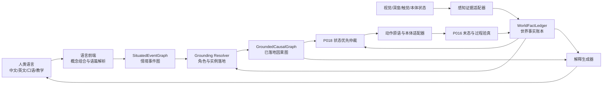

# RELL“书同文、车同轨、度量衡”统一认知架构-v1

日期：2026-07-20

状态：架构母稿

适用范围：P013 任务语义翻译、P016 物理验真、P018 运行时仲裁、P019 端侧概念内化及其工程样品

## 一、结论

RELL 下一阶段不应继续以“为一句自然语言增加一条处理分支”的方式扩展能力，而应把真实场景中的失败收敛为统一认知架构的不变量。

统一认知架构由三个互相约束的部分组成：

1. **书同文**：中文、英文、口语、省略、指代和教学语言，统一编译为机器内部的概念—事件—目标表示；
2. **车同轨**：语言、视觉、触觉、空间状态、任务编排和动作执行，统一使用同一组实体引用、关系谓词和因果算子；
3. **度量衡**：所有候选、事实、报告和经验统一携带证据来源、世界版本、时间范围、验真条件和失效条件。

三者共同解决的不是“机器人会不会回答一句话”，而是以下闭环是否成立：

> 人类语言能够稳定翻译为机器目标；机器能够把目标落到当前世界；机器能够用动作改变世界并验真；机器能够再把依据、过程和边界翻译回人类语言。

## 二、为什么当前修补既有价值又必须收敛

### 2.1 有价值的部分

真实场景持续暴露了以下架构问题：

- 已验真事实未进入恢复后的候选计划；
- 完整语句切成子句后丢失整句角色；
- 历史事件被误当成当前动作；
- 当前关系、历史记忆和人类报告的证据等级混淆；
- 经验模板绕过当前世界事实，从头执行旧路径；
- 相同概念换名称、换实例或换场景后无法复用。

这些失败是有效的压力测试。每一个失败都应形成一个架构不变量和跨场景回归测试。

### 2.2 必须停止的部分

以下做法不得继续成为主路径：

1. 在下游模块重新读取并解析原始自然语言；
2. 以完整句子、固定物体名称或场景 ID 选择执行分支；
3. 用历史任务绑定替代当前世界实例绑定；
4. 用人类报告直接提交物理事实；
5. 用感知候选直接授权执行；
6. 用经验中的原始步骤覆盖当前事实裁剪结果；
7. 在多个模块分别维护“当前对象”“当前目标”和“当前阶段”的不同答案。

因此，后续所谓“修复”必须回答一个问题：它补的是统一表示或统一契约，还是又增加了一个旁路。

## 三、总体架构



这不是要求把所有代码合并为一个模块，而是要求所有模块通过同一套机器语言交换信息。

## 四、统一认知中间表示

统一认知中间表示暂称 `RELL Cognitive IR`，简称 `RCIR`。它不是一句话的槽位表，而是一组可以贯穿语言、世界和执行的基本类型。

### 4.1 七类基本类型

| 类型 | 回答的问题 | 示例 |
|---|---|---|
| `Concept` | 它本质上属于什么 | 可盛装容器、颜色、承载体、人类接收者 |
| `EntityRef` | 当前世界中具体是哪一个 | `entity_17`，不等于显示名称 |
| `Predicate` | 当前或目标关系是什么 | `received_by(x, human)` |
| `Event` | 发生或被报告了什么变化 | 抓取、放置、饮用完成 |
| `Goal` | 希望最终什么事实成立 | `received_by(filled_x, human)` |
| `Constraint` | 哪些条件限制角色或过程 | 颜色、材质、温度、承载能力 |
| `EvidenceEnvelope` | 为什么相信它、何时失效 | 触觉验真、视觉候选、人类报告 |

### 4.2 概念不等于词语

概念是可跨语言、跨名称、跨实例复用的结构：

```json
{
  "concept_id": "concept_fillable_container",
  "super_concepts": ["concept_physical_object", "concept_container"],
  "perceptual_invariants": ["bounded_inner_volume", "open_or_fillable_access"],
  "functional_affordances": ["graspable", "receive_liquid"],
  "state_schema": ["empty", "filled", "held", "supported"],
  "language_adapters": {
    "zh": ["杯子", "水杯", "饮具"],
    "en": ["cup", "drinking vessel"]
  }
}
```

“白色马克杯”应组合为：

```text
head_concept = concept_fillable_container
constraints = [color=white, container_form=mug]
```

不能把“白色马克杯”整体固化为一个不可分词项，也不能把品牌、型号或对象显示名当作概念本体。

### 4.3 机器谓词是跨层轨道

同一个谓词必须同时可被语言目标、世界事实、经验前提和动作效果引用。例如：

```text
received_by(container, human)
supported_by(payload, carrier)
held_by(object, executor)
contains(container, liquid)
reachable(executor, entity)
```

语言层可以提出这些谓词作为目标；感知和执行层只能以证据候选或验真结果更新这些谓词。

## 五、书同文：人类语言到机器语言

### 5.1 单一编译入口

每轮人类输入只允许经过一次正式语言编译，生成不可变的 `SituatedEventGraph`。图生成后，下游模块禁止重新解析原始字符串。

`SituatedEventGraph` 至少包含：

```json
{
  "utterance_ref": "turn_42",
  "speech_act": "task_request",
  "events": [],
  "reported_events": [],
  "goals": [],
  "roles": {},
  "constraints": [],
  "discourse_links": [],
  "temporal_scope": "current_with_recent_reference",
  "unresolved_variables": [],
  "physical_fact_committed": false
}
```

### 5.2 整句语义先于子句执行

子句可以形成独立事件节点，但整句的角色、时态、因果连接和省略关系必须先完成，再允许拆分执行。

例如：

> 我喝完了，再接一杯水。这次把杯子放在托盘里然后给我。

应编译为：

```text
reported_event:
  consumption_completed(agent=human, theme=?payload)
  evidence=human_report
  physical_fact_committed=false

goal:
  received_by(?payload, human)

required_relations:
  contains(?payload, water)
  supported_by(?payload, ?carrier)
  held_by(?carrier, executor) at terminal

role_constraints:
  ?payload affords receive_liquid
  ?carrier affords transport_supported_payload
```

“给我”虽可构成省略子句，但其接收者角色必须进入整句目标；“喝完了”虽不是机器人动作，但必须成为当前关系查询的选择条件。

### 5.3 多语言是多个前端，不是多套认知

中文、英文、方言或行业术语只负责生成相同的 RCIR 结构。语言适配器可以不同，但不得产生不同的物理谓词和动作契约。

翻译正确性的判断不是两句话是否相似，而是它们生成的以下内容是否等价：

1. 目标事实；
2. 角色类型与约束；
3. 时态和事件范围；
4. 未决变量；
5. 代理权和禁止条件；
6. 验真要求。

## 六、车同轨：物理世界到机器语言

### 6.1 世界事实账本是唯一当前真值来源

`WorldFactLedger` 保存当前世界版本下仍然有效的事实。显示文本、任务历史、经验模板和语言解释均不得替代账本。

事实记录至少包含：

```json
{
  "predicate": "received_by",
  "subject": "entity_17",
  "object": "human_1",
  "world_revision": 12,
  "status": "established",
  "evidence_ref": "evidence_93",
  "valid_from": "event_210",
  "invalidated_by": null
}
```

### 6.2 感知只产生候选证据

视觉检测到“像杯子的白色物体”时，输出的是：

```text
perceptual_candidate(entity_candidate, concept_fillable_container)
observed_attribute(entity_candidate, color=white)
```

它不等于：

```text
target_object_in_gripper = true
```

空间落地、关系一致性和动作验真完成后，候选才能晋升为当前事实。

### 6.3 动作原语采用因果契约

动作原语不以固定轨迹为本体，而以类型化前提、效果和验真条件定义：

```json
{
  "operator": "fill_container",
  "roles": {
    "theme": "affords:receive_liquid",
    "source": "affords:provide_liquid"
  },
  "requires": [
    "held_by(theme, executor)",
    "reachable(executor, source)"
  ],
  "projects": [
    "contains(theme, liquid)"
  ],
  "verification": [
    "liquid_level_observed",
    "container_integrity_preserved"
  ]
}
```

轨迹、速度和关节序列属于本体适配后的短期执行细节，完成后释放；因果效果和验真摘要进入事实账本与紧凑事件记忆。

## 七、度量衡：统一证据与验真

### 7.1 证据等级

默认优先级从高到低为：

1. 当前物理验真关系；
2. 当前多模态一致感知；
3. 当前人类显式约束；
4. 当前任务角色绑定；
5. 最近验真事件胶囊；
6. 可信经验或持久概念；
7. 未约束类别候选。

高优先级证据可以排除低优先级候选，低优先级证据不得覆盖当前物理事实。

### 7.2 四种状态必须分开

| 状态 | 含义 | 是否可作为执行事实 |
|---|---|---|
| `reported` | 人类报告某事件或状态 | 否，可触发核查或上下文选择 |
| `observed_candidate` | 传感器形成候选 | 否 |
| `spatially_grounded` | 候选已绑定当前空间实例 | 仅可用于规划候选 |
| `runtime_verified` | P016 验真成立 | 是 |

### 7.3 失败按依赖关系失效

阶段失败不等于整项任务所有事实失效。

当 `fill_container` 末帧验真失败时：

- `container_filled` 不成立；
- 依赖 `container_filled` 的后续事实不得提交；
- 已独立验真的 `held_by(container, executor)` 继续成立；
- 恢复计划必须从事实账本重新裁剪，而不是重放完整经验模板。

## 八、从语义图到因果图

### 8.1 角色落地

角色落地只允许依据以下输入：

1. `SituatedEventGraph` 中的概念和约束；
2. 当前 `WorldFactLedger`；
3. 当前有效感知证据；
4. 必要时的紧凑历史事件查询。

落地结果必须说明：

```text
绑定了哪个 EntityRef
使用了哪些概念约束
依据了哪些当前关系
是否唯一
世界版本是多少
何时必须重新绑定
```

### 8.2 因果图编译

落地后的目标编译为 `GroundedCausalGraph`：

```json
{
  "goal_facts": [],
  "nodes": [],
  "edges": [],
  "joins": [],
  "role_bindings": {},
  "verified_fact_ledger": [],
  "open_conditions": [],
  "authorization_scope": {},
  "verification_contract": {}
}
```

长程与短程不按句子长度区分，而按裁剪后因果拓扑区分：

- 单个已落地效果：原子动作；
- 少量单链节点：短程任务；
- 多分支、汇合、外部条件或未展开宏目标：长程任务。

### 8.3 当前事实裁剪是强制步骤

任何以下入口都必须经过同一个裁剪器：

- 新任务首次编排；
- 阶段失败恢复；
- 用户重复确认；
- 环境变化后重规划；
- 任务切换后恢复；
- 经验召回；
- 长程任务分支汇合。

裁剪规则：排除已完成节点、目标事实已成立节点及其效果已被更强当前事实覆盖的节点。

## 九、记忆生命周期

统一认知不等于保存完整对话和所有细节。记忆分为四层：

| 层级 | 保存内容 | 释放条件 |
|---|---|---|
| 当前世界记忆 | 当前有效事实和对象关系 | 世界变化或明确失效 |
| 任务工作记忆 | 活跃因果图、开放条件、角色绑定 | 目标验真、取消或被替代 |
| 情节胶囊 | 验真事件参与者、前后事实、来源关系 | 有界容量和相关性淘汰 |
| 语义记忆 | 概念、谓词、动作契约、可信经验不变量 | 版本治理或证据撤销 |

必须释放：

- 轨迹；
- 运动帧；
- 已完成叶节点计划；
- 临时澄清文本；
- 旧任务候选链；
- 单次教学按键和绝对坐标。

必须保留但压缩：

- 当前仍成立的物理事实；
- 已验真事件的紧凑参与者与事实变化；
- 已完成任务的目标模式；
- 可迁移概念与经验合同。

## 十、陌生语料与陌生环境的工作流程

### 10.1 陌生说法、已知概念

1. 语言前端识别已知概念组合和未知表面词；
2. 若事件、角色和目标仍可唯一形成，未知表面词只进入语言适配候选；
3. 当前任务继续使用既有概念和谓词；
4. 经人类确认后，只保存表面词到概念的适配关系，不修改物理事实。

### 10.2 已知语言、陌生实例

1. 从概念生成任务条件化感知契约；
2. 在当前环境中寻找满足感知不变量和功能可供性的候选；
3. 多候选时主动观察或询问可观察差异；
4. 唯一落地后生成新的 `EntityRef` 绑定；
5. 经验只提供过程不变量，所有坐标和路径重新规划。

### 10.3 陌生概念

系统必须明确缺失的是哪一种信息：

- 上位概念；
- 可感知不变量；
- 功能可供性；
- 状态模式；
- 可参与关系；
- 动作效果；
- 验真方式。

人类教学或云端补给只能形成候选概念包。候选必须经过观察、操作、预测和验真闭环后，才能成为端侧可信概念。

### 10.4 陌生任务

若目标可以由已知谓词表达，则先反向搜索已知动作原语和经验合同；若缺少生产某个前提的过程，系统应报告具体事实缺口，而不是笼统回答“不会”。

## 十一、机器理解成立的操作性标准

机器“理解一个概念”至少意味着它能够：

1. 把多种语言表达归入同一概念；
2. 在陌生实例上根据不变量识别候选；
3. 预测该概念可以参与的关系和动作；
4. 根据当前事实判断哪些动作可行；
5. 预测动作可能产生和销毁的事实；
6. 通过约定证据判断预测是否实现；
7. 在失败后指出缺失的是概念、实例、能力、资源还是证据；
8. 把机器内部判断翻译回人类语言并给出依据。

只有“识别词语”或“执行过一次脚本”均不构成概念理解。

## 十二、反向翻译与人机同步

机器对人类的回答不得从历史话术模板直接生成，而应由当前 RCIR 状态投影生成。

回答至少可以解释：

- 我理解的目标是什么；
- 当前绑定了哪些对象和角色；
- 哪些事实已经验真；
- 哪些只是人类报告或感知候选；
- 下一步为什么是这个动作；
- 为什么不能执行；
- 需要人类补充的最小信息是什么。

自然语言生成是机器语言到人类语言的反向编译器。正向和反向翻译必须引用同一图、同一事实账本和同一证据封装，避免“内部做一套、嘴上说一套”。

## 十三、模块边界与现有工程迁移

| 现有模块或方案 | 统一架构中的职责 | 需要收敛的边界 |
|---|---|---|
| P013 / `language_concept_composer` | 人类语言到 `SituatedEventGraph` | 每轮只编译一次，输出不可变图 |
| P019 / Concept Core | 概念、别名、可供性、概念证据 | 不直接绑定事实或授权执行 |
| `context_projection` | 为当前输入投影最小相关事实和事件 | 不保存完整旧任务，不复用旧验真账本 |
| 感知落地器 | 概念候选到当前空间实例 | 候选不等于事实 |
| 过程模板与经验库 | 提供事实生产者和过程不变量 | 禁止输出未经当前事实裁剪的完整旧路径 |
| 因果任务图 | 表达目标、节点、分支、汇合和开放条件 | 只消费 RCIR 与结构化角色绑定 |
| P018 Runtime | 状态优先仲裁、切换、恢复、裁剪 | 成为所有执行入口的强制门 |
| P016 | 动作执行与物理验真 | 只按依赖粒度提交或撤销事实 |
| 解释层 | RCIR 到人类语言 | 禁止凭原始话术猜测状态 |

### 13.1 强制禁止原始文本下沉

完成迁移后，以下模块不应再接收自然语言字符串作为决策输入：

- 角色落地器；
- 因果图编译器；
- 经验检索排序器；
- 失败恢复器；
- 动作执行器；
- 物理验真器。

为审计保留 `utterance_ref` 可以接受，但原文不得再次参与决策。

## 十四、架构不变量

以下规则应转为代码断言和回归测试：

1. `language_does_not_commit_physical_fact`；
2. `perception_candidate_is_not_runtime_fact`；
3. `one_turn_has_one_authoritative_semantic_graph`；
4. `downstream_does_not_reparse_surface_text`；
5. `current_verified_relation_precedes_history_and_category`；
6. `every_binding_has_evidence_and_world_revision`；
7. `every_action_has_requires_projects_verification`；
8. `every_recovery_reenters_current_fact_pruning`；
9. `failure_invalidates_only_dependent_facts`；
10. `experience_never_reuses_instance_or_trajectory`；
11. `completed_working_memory_is_released`；
12. `renaming_does_not_change_grounding_result`；
13. `cross_scene_equivalent_facts_produce_equivalent_graphs`；
14. `ambiguous_binding_never_silently_becomes_unique`；
15. `human_explanation_reads_the_same_graph_used_for_execution`。

## 十五、验证方法

### 15.1 表达不变性

同一目标使用不同语序、省略、同义词和语言表达，应生成等价目标与角色约束。

### 15.2 改名不变性

修改对象显示名但保留概念、可供性和当前关系后，落地结果不应变化。

### 15.3 场景不变性

更换坐标、对象实例数量和空间布局后，因果图结构保持，实例绑定和路径重新计算。

### 15.4 证据冲突测试

构造人类报告、视觉候选、历史事件和当前物理事实相互冲突的情况，验证证据优先级和澄清边界。

### 15.5 生命周期测试

验证任务完成后轨迹、子句、候选计划和澄清细节已释放，而当前物理事实、目标胶囊和紧凑事件仍可用于后续指代。

### 15.6 双向一致性测试

机器对外解释中的目标、对象、当前事实、未决条件和下一阶段，必须与实际执行所消费的数据结构逐字段一致。

## 十六、实施路线

### 里程碑 A：冻结统一模式

1. 定义 RCIR 基础类型和版本；
2. 定义 `SituatedEventGraph`、`WorldFactLedger`、`GroundedCausalGraph`；
3. 定义证据封装和事实失效协议；
4. 为现有结构建立兼容转换器。

完成标准：同一条输入只有一个权威语义图，所有绑定均可追踪证据。

### 里程碑 B：建立唯一编排入口

1. 下游模块改为只消费结构化图；
2. 禁止失败恢复、复合子任务和经验召回重新解析原文；
3. 把当前事实裁剪设为所有规划入口的强制步骤；
4. 将旧分支逐步迁移到统一编译器。

完成标准：删除任一场景显示名不会改变任务图；重复确认和失败恢复不会回到已完成节点。

### 里程碑 C：统一物理事实与证据

1. 合并重复的事实来源和阶段快照；
2. 为人类报告、视觉候选、空间落地和 P016 验真建立统一状态机；
3. 实现按依赖关系失效；
4. 解释层直接读取事实账本和因果图。

完成标准：状态查询、任务续推和解释输出引用同一事实版本。

### 里程碑 D：概念形成与跨域迁移

1. 陌生词适配到已有概念；
2. 陌生实例通过感知不变量和可供性落地；
3. 陌生概念通过教学形成候选概念包；
4. 可信经验抽取为无实例、无轨迹的因果合同；
5. 在陌生场景和陌生本体上重新绑定、规划和验真。

完成标准：概念复用不依赖名称，经验复用不依赖实例和轨迹。

### 里程碑 E：多语言与真机闭环

1. 为中文和英文建立独立语言前端；
2. 验证二者生成等价 RCIR；
3. 接入真实视觉、深度、触觉和本体状态；
4. 验证机器解释与真实执行逐事实一致。

完成标准：语言变化不改变机器目标，环境变化只改变实例绑定和路径。

## 十七、开发决策规则

以后每个新案例按以下顺序处理：

1. 记录期望的目标事实、角色、约束和验真条件；
2. 检查权威语义图是否正确；
3. 检查当前事实账本是否包含所需关系；
4. 检查角色落地是否遵守证据优先级；
5. 检查因果图是否正确表达依赖和汇合；
6. 检查 Runtime 是否按当前事实裁剪；
7. 检查 P016 是否只提交已验真效果；
8. 将失败归纳为架构不变量；
9. 增加表达、改名、场景和证据冲突回归；
10. 禁止以整句或场景对象名称作为最终修复。

## 十八、与现有专利和工程线的关系

本架构不替代现有方案，而是规定它们如何通过统一机器语言协作：

- P013 负责“书同文”的任务语义翻译入口；
- P019 负责概念单元、概念证据和端侧内化；
- P012/P017 负责概念与经验跨域迁移；
- P011/P020 负责经验形成和教学闭环；
- P018 负责当前状态优先的运行时仲裁；
- P016 负责事实是否真正成立的物理验真；
- P014 负责失败后的恢复与再适配；
- P015 负责偏好约束，不把偏好冒充物理事实。

统一架构的新增价值在于：上述能力不再通过自然语言字符串、固定模板或隐式共享变量松散连接，而是通过同一套概念、谓词、实体引用、因果算子和证据封装形成闭环。

## 十九、最终判断

“书同文”解决人类说法不同但机器目标应相同的问题；“车同轨”解决语言、感知、规划和执行各说各话的问题；“度量衡”解决候选、报告、历史和物理事实真假混淆的问题。

真正的统一认知不是让机器人记住更多句子，而是让它在陌生表达、陌生实例和陌生环境中，仍能使用同一套机器语言完成：

```text
概念识别 -> 目标形成 -> 当前落地 -> 因果编排 -> 物理执行 -> 事实验真 -> 人类解释
```

当这条闭环成为唯一主路径后，场景测试仍然会不断暴露问题，但每次修复将提升整个底座，而不是只让某一句话暂时可用。
